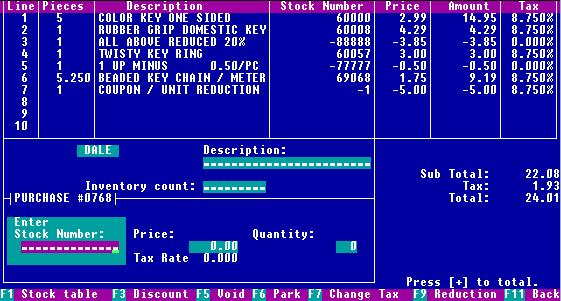

The other day, I stumbled on this 2017 thread from the retro tech Youtuber CathodeRayDude. He complains about the state of modern (circa 2017) UIs and contrasts them with the keyboard-driven UIs of yesteryear. I don't think his point is that _everything_ is worse as a mouse-driven GUI, but that a lot of GUIs would be better designed in a different way.

I was particularly disappointed with the Google Photos UI when browsing the several-thousand pictures in the Redhead Days album after the event, looking for pictures of myself. Photos are sorted by date taken and there appears to be no way to sort them by date _uploaded_. This meant that every few days when I wanted to see if there were newly uploaded pictures that I hadn't seen, I either needed to scroll through every single picture again or use the painfully small "activity" panel on the right sidebar, which also includes every time someone likes/comments on a photo. Sorting a big list of files in a single directory by different criteria has been a standard feature of file/photo browsers for a very long time, and it's frustrating that UIs like this are regressing.

I've copied the thread here since, personally, I hate long-form reading on twitter.

> almost everything on computers is perceptually slower than it was in 1983
>
> amber-screen library computer in 1998: type in two words and hit F3. search results appear instantly.
>
> now: type in two words, wait for an AJAX popup. get a throbber for five seconds. oops you pressed a key, your results are erased
>
> one of the things that makes me steaming mad is how the entire field of web apps ignores 100% of learned lessons from desktop apps
>
> data in webpages in 2017 is distressingly fragile. go to google maps and try and find an action that *doesn't* erase what you're doing
>
> drag the map even a pixel? it erases all your results and closes the infobox you were looking at.
>
> you have a list of interesting locations on the screen but you want to figure out how far they are from the center of town? you can't.
>
> you can open a new tab, do the search there, then flip back and forth manually in the browser. there's no other way.
>
> that is to say, once the data's up on the screen, you *can't add to it*. which is one of the core functions of computers, generally.
>
> one of the primary reasons computers were *created* was to cross reference data. that is nearly impossible in most software now.
>
> maps are a particularly hot item for this. christ, what about looking at a map ISN'T about cross ref'ing data? it's the WHOLE POINT
>
> you have a start and a finish and need to integrate that with geography and roads. and gmaps, bing, etc. are all the worst choice for this.
>
> you are, literally, better off taking a screenshot of the map, dropping it in ms paint and manually plotting there.
>
> gmaps wildly thrashes the map around every time you do anything. Any time you search, almost any time you click on anything
>
> it's a bewildering whirl of colors and shapes that has gotten worse every six months for 15 years
>
> and in doing so it has made humans worse and worse and worse at doing things that computers were created to replace and improve
>
> in 1998 if you were planning a trip you might have gotten out a paper road map and put marks on it for interesting locations along the way
>
> with online maps you CAN do that, but the entire process is built assuming you already know everywhere you're going
>
> It APPEARS to be what you want - you can keep putting in locations and it'll keep plotting them - but in truth it's not at all
>
> The process you WANT: pick your start and end. now start searching for places in between. Your start and end are saved.
>
> When you find someplace interesting, add it to your list. Keep doing that, keep searching and adding.
>
> Search far and wide. Search for cities and then click around inside them. Read reviews. Do street view.
>
> When you're all done, you go back to your plotted trip and start laying out the chosen locations and optimizing your path.
>
> You can do this with a paper map. You can't do this with gmaps. So you just don't do it.
>
> You do something halfass and unsatisfying instead, using multiple tabs or a text file you save addresses in or some shit
>
> You don't even realize why the process is frustrating because it's just The Way It Is.
>
> And everything on computers is like this. It's just How It Is now. You can't fail quickly and iterate.
>
> On the library computer in 1998 I could retry searches over and over and over until I found what I was looking for because it was quick
>
> Now I have to wait for a huge page to load, wait while the page elements shift all over, GOD FORBID i click on anything while its loading
>
> how many times have i typed in a search box, seen what i wanted pop up as i was typing, go to click on it, then have it disappear
>
> I make no secret of hating the mouse. I think it's a crime. I think it's stifling humanitys progress, a gimmick we can't get over.
>
> The mouse is the CueCat except it didn't get ridiculed and reviled as it should have been. It's inappropriate for almost everything we do.
>
> There's no reason for Twitter to use a mouse. There's nothing mousey about this website, not a damn thing
>
> Mice are for rapidly navigating through a complex and unstructured set of objects, like an app with dozens of options and input types
>
> twitter: i need to navigate through a linear list and perform one of four actions on discrete items, almost all text-based ...
>
> 
>
> When computers used interfaces like these they were lightning fast, universally. I've used a lot of them.
>
> The library computers, the homebrew POS at my first job, even the machines at Fry's Electronics use an interface like this.
>
> If you ever go to Fry's, watch the employees use this style of UI. Blinding speed. They ricochet around like pros, even the new people.
>
> And I have to say that it's solely because the mouse is not being used. Mice are bad. Mice are absolutely terrible.
>
> The reason mice are terrible is a matter of basic facts about human brains, hands, eyes and muscles. Hell, I think Jef Raskin covered it.
>
> Keyboards present fewer possible discrete options. Mice present a continuum. One can be operated blind; the other requires feedback.
>
> You cannot use a mouse without using your eyes to confirm everything. At my first job I rang people up without looking at the screen
>
> POS software is designed VERY pragmatically. Typically there is no concept of "input focus"; all text goes to one field.
>
> In this UI, most likely at any given moment keyboard entry will ONLY go to the "Stock Number" field.
>
> 
>
> When you walk up to this computer, you can rest assured of the following:
> a) your input will go there
> b) if not, pressing escape will fix it
>
> If you don't know the stock number, press F1 to be transported AWAY FROM THIS INTERFACE to look it up. this is critical.
>
> i posit that nobody wants autocomplete-style live DB lookups. They don't fit the mold that autocomplete fits in.
>
> When you're unsure of even what search term you want, you are already context switching. That means changing interfaces is okay.
>
> If you DON'T do that, you're trying to cram a side-mission - figure out what search term I'm looking for - into a UI not designed for it.
>
> Anyway. Once you find the stock number you want, the price shows up. Hit F3 to edit it. * to change quantity. Enter to add to invoice.
>
> In practice this is incredibly fast. You can't even see it happening, because there's no reason to except to verify after the fact.
>
> The operator doesn't have to stop for every action and figure out what they're doing time and time again. It's all muscle memory.
>
> The cashiers hands are just a blur on the keys. They're looking at the products, not the screen. And they get it right.
>
> Part of the reason for this is that the entire keyboard gets used, including the function keys. INCREDIBLY powerful, those.
>
> God. God! What a tragedy, that we left them in the past. What a heinous crime that we forgot their value.
>
> Look at that UI up there. Look how many functions you can access AT ANY TIME. You can RELY on them. They will ALWAYS be there.
>
> In these systems, the screen was always dominated by a specific form that you could identify from across the room.
>
> Invoice form
> Stock lookup form
> Customer lookup form
> Payment form
> And the F-keys were *always* bound to that form.
>
> This allowed your /human brain/, a flawed but powerful tool, to use the computer INTUITIVELY
>
> As you approach e.g. the cash register, you take one look at the screen and instantly your synapses wire themselves up for the F-key layout
>
> If the register is on the stock lookup screen, your hands fall on the keyboard and automatically do what's needed
>
> Escape-escape to get to the login screen, fingers on the numpad hammer in your employee ID, F2 to cancel retail customer lookup
>
> And now you're ready to start keying in items. No "getting your bearings." You don't even stop talking to the customer. 1/10th of a second.
>
> To be clear, the web as I envision it does not look like what we have. Not one bit. It's completely different.
>
> And it's worth noting that HYPERTEXT, specifically, is best with a mouse in a lot of cases. Wikipedia would suck on keyboard.
>
> This is a FANTASTIC example of a mouse-optimal document. Any keyboard approach would be mediocre at best.,
>
> 
>
> Your brain is GREAT at identifying points of interest here. From this array of 20+ unstructured links I can grab the ones I want.
>
> Like a grocery store shelf, you can double-fist it if things are organized appropriately. I've grabbed beans and rice simultaneously before
>
> Your brain highlights the points of interest like a T-1000 and bam bam bam you grab everything you need. New tab new tab new tab.
>
> Twitter, however, is deeply linear, as is Google, eBay, Dropbox, bug trackers, IM clients
>
> I could continue to talk for hours about this but I think I covered the bases. RT as desired.
>
> A comment - although I appreciate all of you that are recommending apps better than gmaps and keyboard browser plugins and the like...
>
> I want to clarify that I am literally talking about the future of the human race and I am deadly serious about this. It's not about me.
>
> I do OK. I'm an extremely experienced user, I can overcome everything this garbage industry throws at me, albeit bitterly.
>
> I am mad that commodity software that people don't even RECOGNIZE as software, like gmaps, is so far through the looking glass.
>
> It makes me mad that Joe Q Middleage, Safeway manager in New Jersey, can't use the computer better bc it sucks so bad.
>
> Joe is using the computer to emulate labor-intensive manual work on paper and he doesn't even know he's being shafted
>
> Joe should be offered incredible power by software that encourages him to use it with purpose-built interfaces optimized for him.
>
> I am upset by the way that computers disenfranchise non-nerds. I wish it was better for me; I wish it WORKED AT ALL for everyone else.
>
> another thing you should know about me - and this is where i think a lot of people will start disagreeing - I don't believe in "intuitive"
>
> I think it's a crock of shit. Hogwash. Absolutely false. The belief that GUIs are more intuitive is marketing for GUIs.
>
> GUIs are in no way more intuitive than keyboard interfaces using function keys such as the POS I posted earlier. Nor do they need to be.
>
> GUIs require you to learn how to use a mouse, how input focus works, how multiple windows work, how modal dialogs work.
>
> I believe well designed keyboard interfaces and well designed GUI interfaces have exactly the same learning curve.
>
> The problem is you can't prove that now because we spent the last 25 years teaching people ONLY GUI and mouse.
>
> Nobody will agree with me, citing anecdotes and examples that are meaningless in the current zeitgeist.
>
> All UIs require a common language. The common language of quality keyboard interfaces was no different than GUIs.
>
> People get upset by OPAQUE keyboard interfaces, which I don't disagree with. The POS software I posted earlier is not opaque.
>
> Once you understand the basic language of keyb UI, those textmode interfaces are completely intuitive by the same standards.
>
> The other thing I think maybe some people don't get - I'm not advocating textmode. Why would I do that? Graphics and keyboard work fine.
>
> Character cell graphics offer some benefits that aren't worth discussing; they are not an option for plenty of reasons now.
>
> The cash register software I used at my last job was graphical AND keyboard based. Worked fine. Used function keys.
>
> If I could do this thread over again, I'd just alter 1983 to 1987, I think. '83 might have been too aggressive. But it wasn't literal anyway
>
> If this thread positively affected you, can I ask you to throw me a couple bucks? [http://ko-fi.com/gravis](https://t.co/nr8MmUgne2) I recently had a water main burst and the plumbing cost a fortune.
>
> Check out my YouTube channel where I look at old software, and should be posting some videos on 80s utilities soon
>
> Video cameras, computer mice, and the 2000s in general are my usual topics. I'm sure I'll waver eventually. I hate capitalism and I'm not here to get sponsorships, I just want to share what I'm up to...

https://x.com/gravislizard/status/927593460642615296
