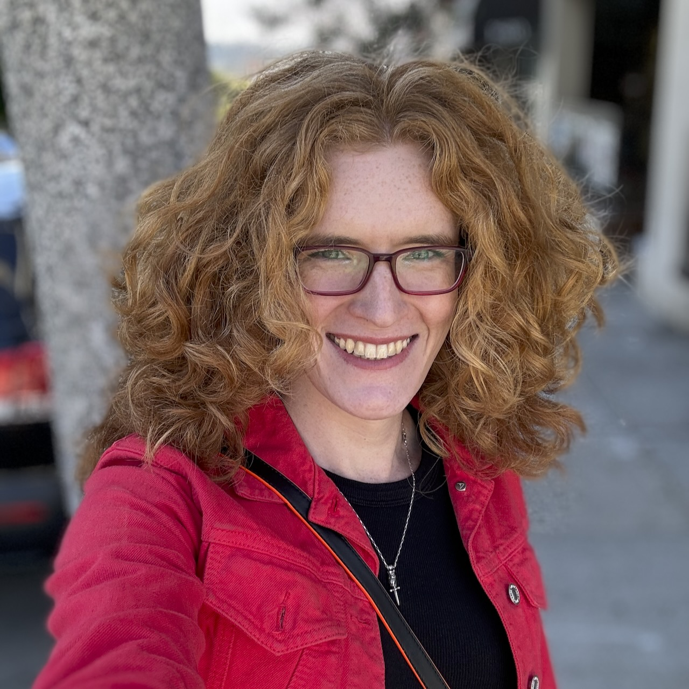

Hi, I'm Lily (she/her)! I'm a software leader/developer in San Francisco, with a
passion for making highly performant applications that never stop delivering
value.

| **Likes**                      | **Dislikes**                                                      |
| ------------------------------ | ----------------------------------------------------------------- |
| Rust (Programming Language)    | Rust (Chemical Reaction)                                          |
| Python                         | Pythons                                                           |
| Go                             | The idea that Go doesn't need generics                            |
| Automating the boring stuff    | Hearing "But this is how we've always done it!"                   |
| Optimizing                     | Branch prediction failures                                        |
| Open source                    | Open sores                                                        |
| Git                            | SVN                                                               |
| Soap                           | [SOAP](https://en.wikipedia.org/wiki/SOAP)                        |
| Rhyme-based puns               | Going for runs                                                    |
| When the computer goes "beep!" | When the computer goes "boop!" (scary, where did you learn that?) |
