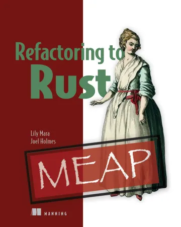

Refactoring to Rust is a new book that I'm working on. It is about the gradual
addition of Rust code to existing software projects. Since you presumably have
some software running in production, the incremental process can provide a
faster route to running Rust in production and better performance than you could
get from a greenfield Rust rewrite.

You can find out more about it on the [publisher's website](https://www.manning.com/books/refactoring-to-rust?utm_source=mara&utm_medium=affiliate&utm_campaign=book_mara_refactoring_1_6_21&a_aid=mara&a_bid=eedce54d)!
