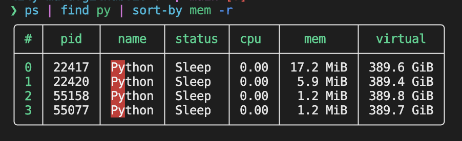
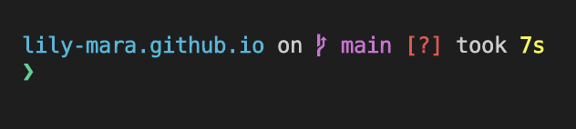
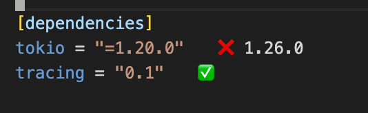
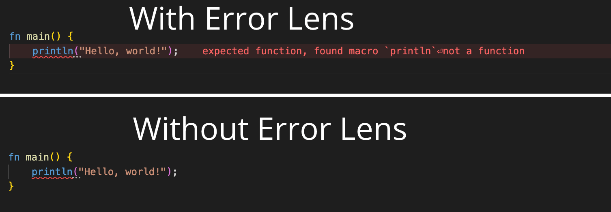

Thanks to the fact that I sometimes share coding videos on my [YouTube
channel](https://www.youtube.com/@lily-mara), people occasionally see what my
workflow looks like and they ask me what plugins I'm using. This is
non-exhaustive, really just intended to be a canned response.

# Shell - Nushell



I've been using [Nushell](https://www.nushell.sh) as my daily driver shell for
the past few years. It's really cool! Imagine if your shell had first-class
support for structured data, had useful error messages, and removed all the
esoteric syntax of bash in favor of something that looks much closer to a modern
scripting language. There are still some rough edges, but it's nothing that's
been a detrement to my workflows. It's easy enough to shell out to bash/zsh if
absolutely required.

Here's an example: the [`watch`](https://linux.die.net/man/1/watch) program
re-runs the given command at a fixed time interval that you give it. If I wanted
to pull the contents of a webpage every 10s, I could do this:

```shell
watch -n10 curl https://api.github.com/repos/nushell/nushell
```

But what if I wanted to do something with the output of that command instead of
getting all of it in the output?

```shell
watch -n10 curl https://api.github.com/repos/nushell/nushell | jq .license
<hangs forever>
```

Since `watch` is just taking a command as a string and executing it, the shell's
argument parser thinks that the pipe is a part of the next command and it tries
to feed the output of `watch` itself to `jq`, instead of feeding it the output
of `curl`. We can get around this via quoting

```shell
watch -n10 'curl https://api.github.com/repos/nushell/nushell | jq .license'
```

But as commands like this start to get more complex, we run into bash's weird
quoting behavior. Let's contrast this with a similar command in Nushell. At time
of writing, there is not a direct replacement for `watch` available in Nushell,
but it's relatively straightforward to put together the primitives it does
provide into a similar tool.

```shell
loop {
    clear # clear the screen so we don't see stale output
    curl https://api.github.com/repos/nushell/nushell | jq .license # run the thing we care about
    sleep 10sec # wait the amount of time we care about
}
```

This has a number of differences to the standard `watch` program:
- There is a "block" that all of the commands run in, this allows for much
  simpler nesting than quotes
- The `sleep` command takes a `duration` type rather than just a number, so
  there's no ambiguity as to what a `10` means
- We didn't need to re-implement shell parsing, as a number of standard shell
  programs do when they take in other commands like `watch` does

If we wanted to package this as a
[function](https://www.nushell.sh/book/custom_commands.html) like `watch` so
that it was a little easier to use, we can do that as well.

```shell
def watch [--sleep_time(-t):duration = 1sec, cmd: block] {
    loop {
        clear
        do $cmd
        sleep $sleep_time
    }
}

watch -t 10sec { curl https://api.github.com/repos/nushell/nushell | jq .license }
```

We even get some basic parameter documentation for free!

```shell
watch -h

Usage:
  > watch {flags} <cmd>

Flags:
  -t, --sleep_time <Duration> -
  -h, --help - Display the help message for this command

Parameters:
  cmd <block>:
```

Nushell has a number of features that I think make it a great shell, and I'm not
going to go into all of them here. Check out their
[documentation](https://www.nushell.sh/book/) for more information!

# Prompt - Starship



[Starship](https://starship.rs) is a very cool, very fast promt that works
across a number of shells. I used to use it back when I used zsh, and I continue
to use it today in Nushell. I do not have any custom starship configs, I just
use the defaults.

# Editor - VSCode

I use [Visual Studio Code](https://code.visualstudio.com) with a number of
plugins. I use the default VSCode dark theme.

## Plugin - crates



[crates](https://marketplace.visualstudio.com/items?itemName=serayuzgur.crates)
shows you what dependencies in your `Cargo.toml` files are up-to-date and which
ones need updating.

## Plugin - Error Lens



[Error
Lens](https://marketplace.visualstudio.com/items?itemName=usernamehw.errorlens)
puts diagnostic error messages in your editor view, so it's much easier to see
where you've gone wrong. It's not specific to Rust at all, it works with
anything that outputs diagnostics via the standard VSCode APIs.

## Plugin - GitLens

[GitLens](https://marketplace.visualstudio.com/items?itemName=eamodio.gitlens)
provides additional functionality on top of the built in VSCode git features.

## Plugin - rust-analyzer

[rust-analyzer](https://marketplace.visualstudio.com/items?itemName=rust-lang.rust-analyzer)
is the official Rust plugin for VSCode that provides autocomplete and error checking.
