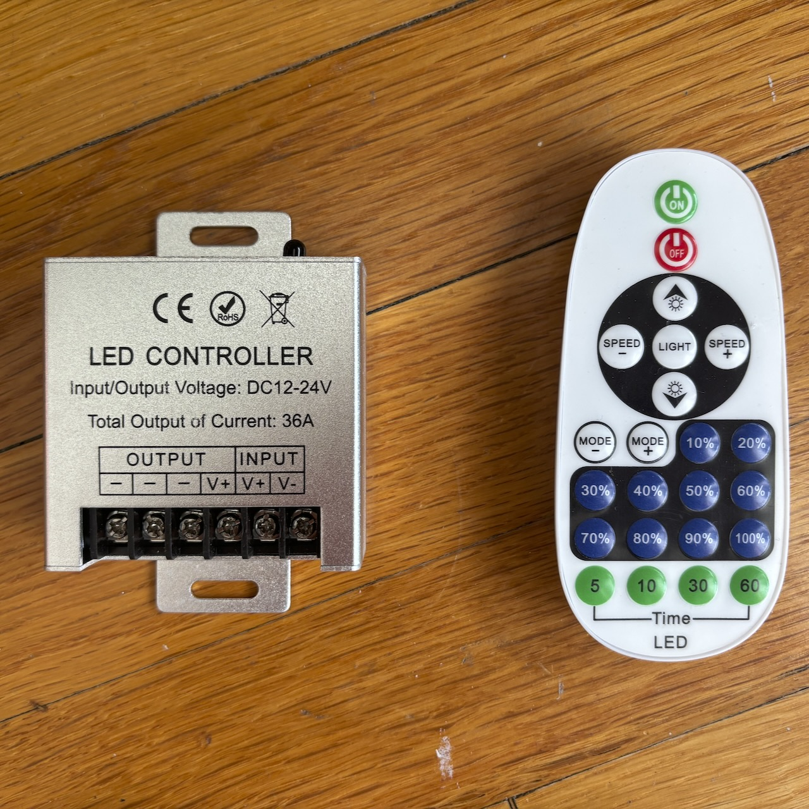
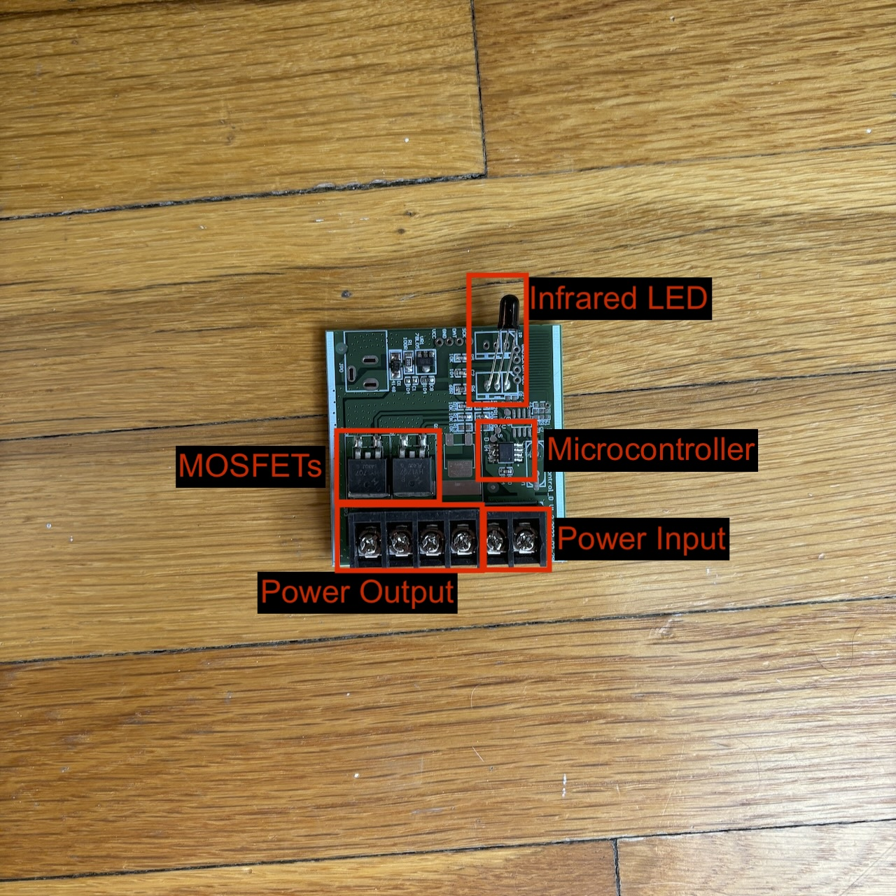

I was recently given a very thoughtful gift, a custom LED sign from [Custom
Neon](https://customneon.com) reading "Stay Silly."


I first heard this from
[Maia Arson Crimew](https://maia.crimew.gay) earlier this year in a Twitter post
about being investigated by US Congress after it discovered a [vulnerability in
an airline's storage of the FAA no-fly list](https://maia.crimew.gay/posts/how-to-hack-an-airline/).


I and [a lot of other
people](https://knowyourmeme.com/memes/the-horrors-are-endless-but-i-stay-silly)
found this endearing and so started saying it frequently when faced with any
kind of adversity or stress. One of my partners noticed this and she got me this
beautiful sign.

The sign came with a small box that sat between the power supply and the light,
and an IR remote to control it. The remote let me turn the light on and off,
change the brightness level, and display a few pre-programmed light patterns
such as flashes and fades.



I loved the sign but I did somewhat bristle at the control options that were
available out of the box. I have recently been experimenting with using open
source home automation software and this seemed like the perfect fit. I wanted
the ability to turn the light on and off from my phone/siri without finding a
remote, and I disliked the hard on/off cutover that this controller had, I
wanted it to fade on/off. I immediately saw this as an opportunity for a
project. Initially, I considered attaching a microcontroller with an IR blaster
to the existing controller and emitting IR signals to control the light. This
would have allowed me to control the light using my phone, but wouldn't have
solved the fade in/out problem. I could have issued brightness changing IR
commands, but those had no intermediate states so the brightness would have gone
from 0% to 10% to 20% in instantaneous steps.

On the advice of my friend Chloe, I decided to replace the entire controller!

Before I can replace the controller, I need to understand how it works. This
seemed straightforward enough. I looked at the power supply and found it to be
rated to output DC 12V 6A. I connected a multimeter to the output pins of the
controller box and turned the light on, to find that it was also outputting DC
12V. I changed the brightness and found that the voltage was being stepped down
at around the same rate as I was decreasing the brightness, and reasoned that
the light's brightness was probably simply controlled by changing the voltage
provided to it. Opening up the control box confirmed this, showing that there
was a small microcontroller and some MOSFETs between the input and output pins.



With this information, I reasoned that I could probably replace the control box
fairly easily. Coincidentally, Chloe was just about to start shipping out her
ESP-32-C3-based development kit _specifically designed for ESPHome integration_,
the [Voidbox Flip-C3](https://www.vdbx.io/product/flip-c3), and she had some
advice for me on how to approach the project. I bought one of her boards and she
was even so kind as to give me a MOSFET breakout board for my project. All I
needed to do was to solder the header pins onto the two boards, connect them to
each other, and write the software for controlling the light.

First up was soldering, and while I do have a few shitbox radio shack soldering
irons floating around my moving-box-filled apartment, I decided to go into
[Queerious Labs](https://queeriouslabs.com) to use their much more capable and
much less annoying Hako soldering station. This also provided me the opportunity
to make a friend, who helped me test the MOSFET afterwards because I don't know
anything about circuits! (I almost failed E&M)

<div class="callout">
    <div class="callout-inner">
        <div class="callout-header">aside</div>
        <p>
        Hackerspaces like Queerious Labs are super valuable not just as
        workspaces for people doing interesting projects in cities like SF (most
        people here don't have garages or a bounty of space for projects), but
        also as social hubs for meeting like-minded hackers and makers. A free,
        radically inclusive hackerspace like QL is especially cool.
        </p>
    </div>
</div>

Now that I'd done the basic wiring, I had a microcontroller connected to some
MOSFETs, and the barrel plugs that the 12V system used were screwed into the
terminals of the MOSFET breakout board. All that was left was to write the
software tying it all together. Luckily a lot of this work was already done for
me in the form of ESPHome.

[ESPHome](https://esphome.io) is a YAML-based framework for writing firmware for
ESP-32-based microcontrollers and controlling them with the [Home
Assistant](https://home-assistant.io) open-source home automation software. This
means that we can write a few small YAML files, which will be turned into C++
code and compiled into a firmware binary for the ESP-32 chip. ESPHome abstracts
away a lot of the common things you might need to worry about:

- Connecting to Wi-Fi
- Logging
- mDNS for rapidly finding/connecting to new devices
- Common protocol for talking between devices & Home Assistant
- Over-the-air updates
- Integrations with common electronics hardware (sensors, lights, displays, touchscreens, etc)

Having all of this as a base is extremely valuable, I probably wouldn't take the
time to make something as full-featured as an ESPHome firmware build by hand
with C++! But I did have one problem though. I really don't like YAML ([actually
lots of other people dislike it too](https://noyaml.com)). I do sometimes write
YAML for work, but since this is a silly personal project, I figured I could get
away with not writing YAML. I reached for (what I think is) a reasonable choice
for a project like this, [Jsonnet](https://jsonnet.org). Jsonnet is a
configuration language that's a superset of JSON with support for things like
variables, expressions, loops, conditionals, etc. I was first introduced to it
by using the [Grafonnnet](https://grafana.github.io/grafonnet/) library at work
to generate Grafana dashboards.

Jsonnet lets you do things like this:

```jsonnet
local one_thru_five = std.range(1, 5);

{
  values: [
    {
      id: idx,
      value: one_thru_five[idx],
      double: one_thru_five[idx] * 2
    }
    for idx in std.range(0, std.length(one_thru_five) - 1)
  ],
}
```

Which would expand into the following JSON

```json
{
  "values": [
    {
      "double": 2,
      "id": 0,
      "value": 1
    },
    {
      "double": 4,
      "id": 1,
      "value": 2
    },
    {
      "double": 6,
      "id": 2,
      "value": 3
    },
    {
      "double": 8,
      "id": 3,
      "value": 4
    },
    {
      "double": 10,
      "id": 4,
      "value": 5
    }
  ]
}
```

Jsonnet is a language that's compiled/expanded into JSON. Since [YAML is a
strict superset of JSON](https://yaml.org/spec/1.2.2/#12-yaml-history), we can
also say that Jsonnet expands into valid YAML. So we can write Jsonnet and have
that expanded to JSON, then feed that JSON into ESPHome. ESPHome will take the
JSON, expand that into C++, compile that C++ into firmware, and ship it to the
microcontroller via an OTA update process.


This process is very silly but it does mean that I don't have to write YAML,
which I think is pretty neat.


But most people are not actually going to be using this silly flow that I've
built up. Most ESPHome users should be perfectly happy using their YAML config
files. The actual YAML that you need to control this light (assuming the MOSFET
is on pin 7) is this:

```yaml
light:
  - effects:
      - pulse:
          name: gentle pulse
          transition_length: 2s
          update_interval: 2s
    name: Silly Light
    output: gpio_7
    platform: monochromatic
output:
  - id: gpio_7
    pin: GPIO7
    platform: ledc
```

So when all of this gets put together, I ended up with a very nice light that I
can control via Home Assistant easily, and when I turn it on and off, I get a
nice beautiful fade :)



<video controls width="100%" src="./silly-light.mp4">


