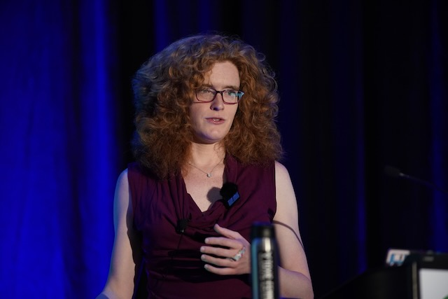

I spoke at QCon NYC 2023 about how OneSignal built a pipeline for processing
Postgres updates using highly concurrent Apache Kafka consumers, and the
struggles that we ran into during that process.

[Download slides](./slides.pdf)
