I live in San Francisco, and I don't own a car. This means that I walk or take
public transit nearly everywhere that I go. There's a lot of ways to find out
when the next bus/train/tram/trolleybus/cable car/ferry is stopping nearby so
that you don't miss it. There are no shortage of apps that will guide you to
your destination using any and all means of public transit, and those are great!
I particularly like [CityMapper](https://citymapper.com). But apps aren't always
the best for getting around a city, especially for leaving your own apartment.

The most frustrating thing about these transit apps is that they assume that
they're going to guide you through the entire transit process. They often work
on the "where are you and where are you going" model of something like Google
Maps. This is great for people new to a city, or exploring a new area of the
city, they can get all the guidance they need. But when I'm leaving from my own
apartment, I know where the closest transit stops are and where they go. I don't
need an app to tell me _which_ line to take to go downtown, I really just need
to know _when_ each transit line has an upcoming train/tram/bus. These goals are
at odds with the goals of a general-purpose navigation app that's somewhat
useful to everyone in a broad range of circumstances, so like most truly useful
things we need to build it ourselves.

I was first inspired to build this project after reading [Matt Healy's 2021 blog
post](https://matthealy.com/kindle) on building a smart home display with a
Kindle. Matt used an old Kindle to display things like weather, calendar events,
meal plans, and house cleaning schedules. I figured I could probably adapt his
guide and make myself an always-available display of upcoming transit arrival
at the stops nearest to my apartment. I also saw [Ben Borgers'
post](https://ben.page/eink) about using an old Nook as an iCloud photo frame.
These devices are super cool, and can be had for quite cheap. I had a few old
Kindles lying around collecting dust, and I was excited at the prospect of using
them for something productive again.

<div class="callout callout-warning">
	<div class="callout-inner">
        <div class="callout-header">WARNING</div>
        <p>This is a long blog post. It was a lot of work writing it, so I hope you read it all and enjoy (and email me to tell me you liked it pls), but yeah you're in for a long one here.</p>
  </div>
</div>

<div class="callout">
	<div class="callout-inner">
        <div class="callout-header">GOAL</div>
        <p>Display upcoming transit arrival times on a Kindle</p>
  </div>
</div>

# Jailbreaking your Kindle

The first step is to jailbreak your Kindle. I'm not going to detail the steps
required to accomplish this here, there are numerous guides out there. The
[mobileread
wiki](https://wiki.mobileread.com/wiki/Kindle_Hacks_Information#Jail_break_JB)
and forums were an invaluable resource during this process. The main goal here
is to enable USBNet, this will give us the ability to SSH into the kindle, which
we will use to set up the cron job that updates the display.

- [Jailbreak](https://www.mobileread.com/forums/showthread.php?t=346037&highlight=wifi)
- [All hacks](https://www.mobileread.com/forums/showthread.php?t=225030)
  - [Launcher](https://www.mobileread.com/forums/showthread.php?t=203326)
  - [Package installer](https://www.mobileread.com/forums/showthread.php?t=251143)
  - Usbnet - enabled via the package installer
  - [Setting up usbnet in macOS](https://www.mobileread.com/forums/showpost.php?p=2895606&postcount=13)

# Get an Image on the Kindle

Now that the Kindle is jailbroken, I set out trying to get some image to display
on the Kindle. It was no use setting up a system to automatically build the
images for showing on the Kindle if I couldn't first get _something_ on there to
show up in a readable state. This was much more of an adventure than I was
expecting.

<div class="callout">
	<div class="callout-inner">
        <div class="callout-header">SUB-GOAL</div>
        <p>Display <em>some</em> image on the Kindle</p>
  </div>
</div>

First, I identified the image that I wanted to Display. Thankfully, BART (the
main transit agency that I used at the time I started the project) has a website
that provided basically exactly what I wanted. BART's [Real Time
Departure](https://www.bart.gov/schedules/eta/CIVC) page shows all of the
upcoming trains at whatever station you want, and it even refreshes itself in
the background.

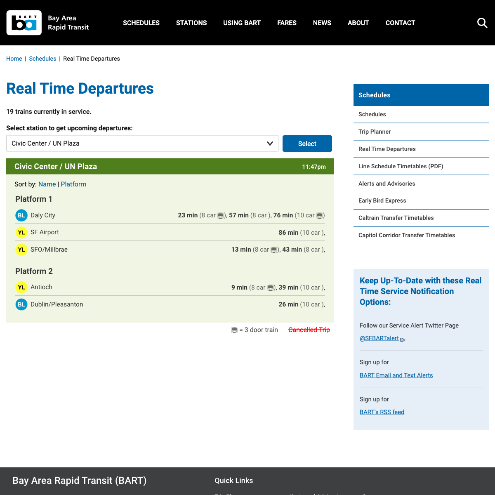

I grabbed a screenshot of the central area of the page, which seems almost
designed to be a standalone dashboard, transferred it to the Kindle, and
attempted to display it. The Kindle CLI has a tool that can be used to display
image files easily.

```sh
# On laptop
$ python3 -m http.server

# On Kindle
$ wget 192.168.50.28:8000/bart-screenshot.png
# Clear the e-ink display
$ eips -c
# Display the PNG file on the display
$ eips -g bart-screenshot.png
```

After attempting to display my screenshot, it was apparent that it wouldn't be
quite so simple.


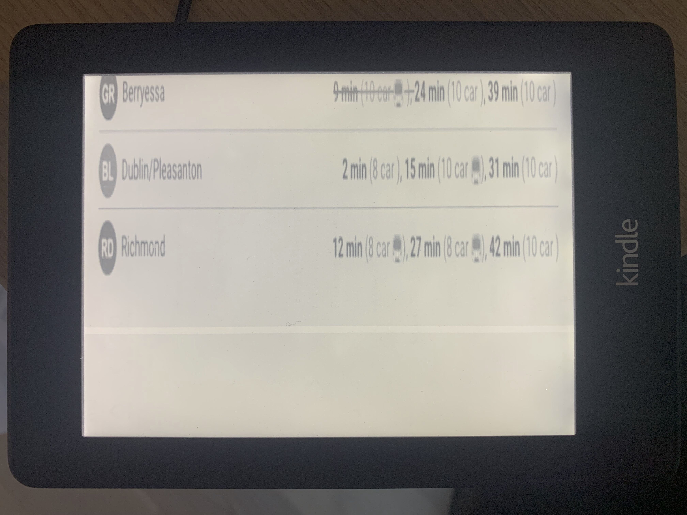


The image was stretched to such an extreme extent that it was unusable. I went
back to the drawing board. I created a "calibration image" in
[Photopea](https://photopea.com), my image editor of choice, and set out trying
to figure out where I went wrong. The image was the exact size of my Kindle's
display - 1024x758. After displaying the image on my Kindle, I started to piece
together what might be going on. Take a look at the expected PNG image, and what
actually showed up on the Kindle display:






Based on the stretch of the image, and the fact that the image seemed to cut off
around 33% of the way through the x-axis, I tried shrinking the image's
horizontal dimension to 1/3, so it was now 1024x252. This provided _slightly_
better results, but something was still very clearly wrong.



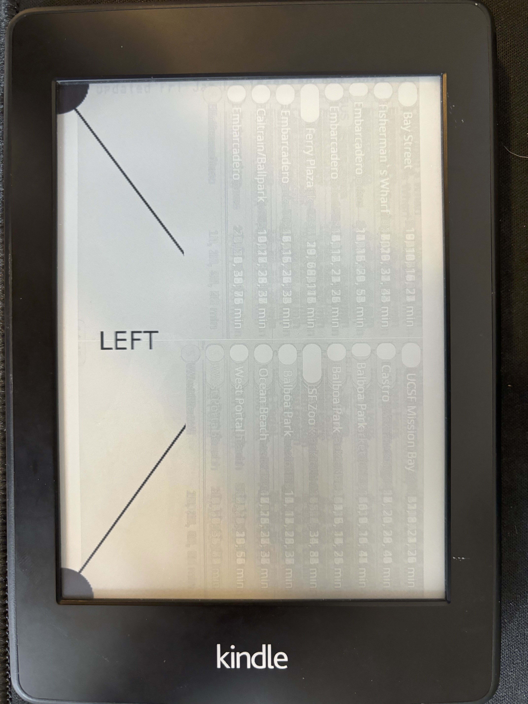


I noticed this time that the image appeared to be un-stretched, but it didn't
fill the entire screen. I reasoned that the Kindle must be displaying only the
pixels that fell within the bounds reported in the PNG metadata. I created
another calibration image which had the full size of the Kindle display, but
only put data in the left 33% of it. This was the most promising result yet.






I applied this "empty space & stretching" technique to my BART screenshot, and
displayed it on the page. initially, this looked very promising. On closer
inspection however, I was disappointed.

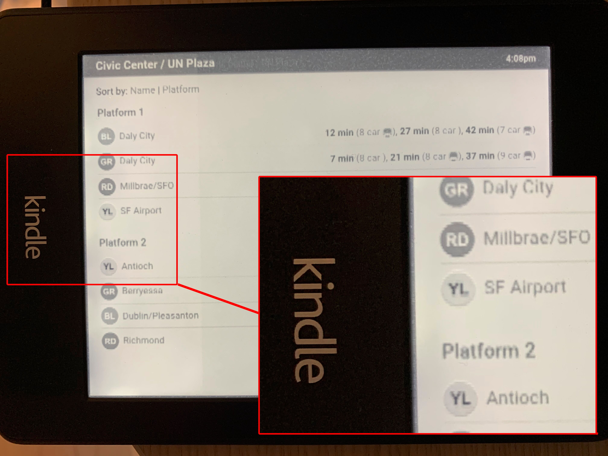

The image appeared extremely pixelated on the Kindle display. Notice in the
image that the text "Kindle" on the frame is very clear, the pixelation on the
display is _not_ because of the camera, it is an issue with the display.

Matt Healy had helpfully linked to the code he was using to drive his Kindle
display, and I figured he must have figured this issue out if his Kindle was
working correctly. I looked through his Node.js code and quickly found [this
critical
function](https://github.com/lankybutmacho/web-to-kindle-heroku/blob/2a9473f30c71a257931927aa0af73bd16bd800a3/index.js#L36C1-L48C2):

```js
function convert(filename) {
  return new Promise((resolve, reject) => {
    const args = [
      filename,
      "-gravity",
      "center",
      "-extent",
      "600x800",
      "-colorspace",
      "gray",
      "-depth",
      "8",
      filename,
    ];
    execFile("convert", args, (error, stdout, stderr) => {
      if (error) {
        console.error({ error, stdout, stderr });
        reject();
      } else {
        resolve();
      }
    });
  });
}
```

He feeds his screenshots into [ImageMagick](https://imagemagick.org/index.php)'s
`convert` utility and does a few things with them, but of particular note are
these arguments

```sh
-colorspace gray -depth 8
```

Of course! I was feeding a 24-bit (3 channel RGB) PNG image into the Kindle's
software, but the Kindle has only a greyscale screen, so they never bothered to
add support for 24-bit PNG files. The "normal" image appears stretched because
as far as the Kindle is concerned, all of the pixels are triplicated, it just
naively reads image data out of the PNG blob and assumes it's an 8-bit image. It
cut off the 1/3 width image partway through the display because the width
metadata on the image made the Kindle think it should only render it over 1/3 of
the screen. The 1/3 width data, full-width metadata image works but looks poor
because 2/3 of the resolution is being sacrificed. After using `convert` to turn
my screenshot into an 8-bit PNG image, it displays correctly on the Kindle.

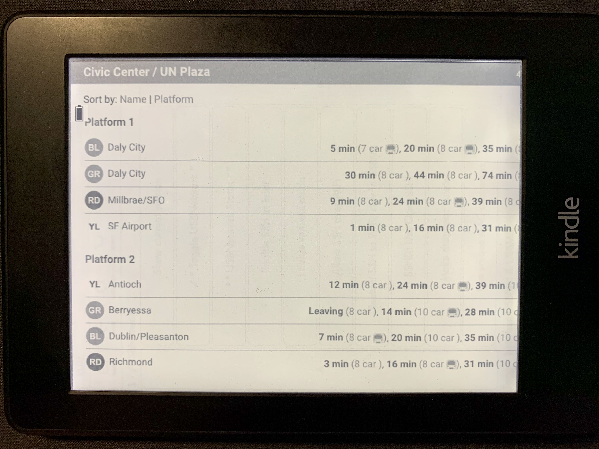

Now that I can display an image that looks alright, I padded the image so that
it would fully fit within the viewport of the Kindle and re-displayed it.


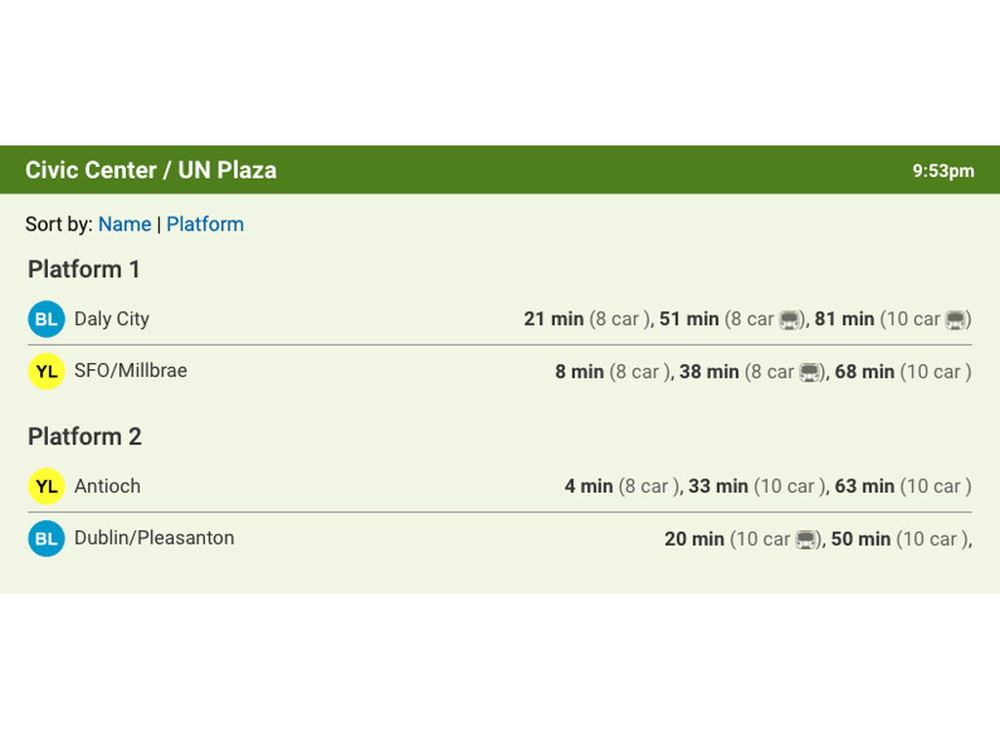
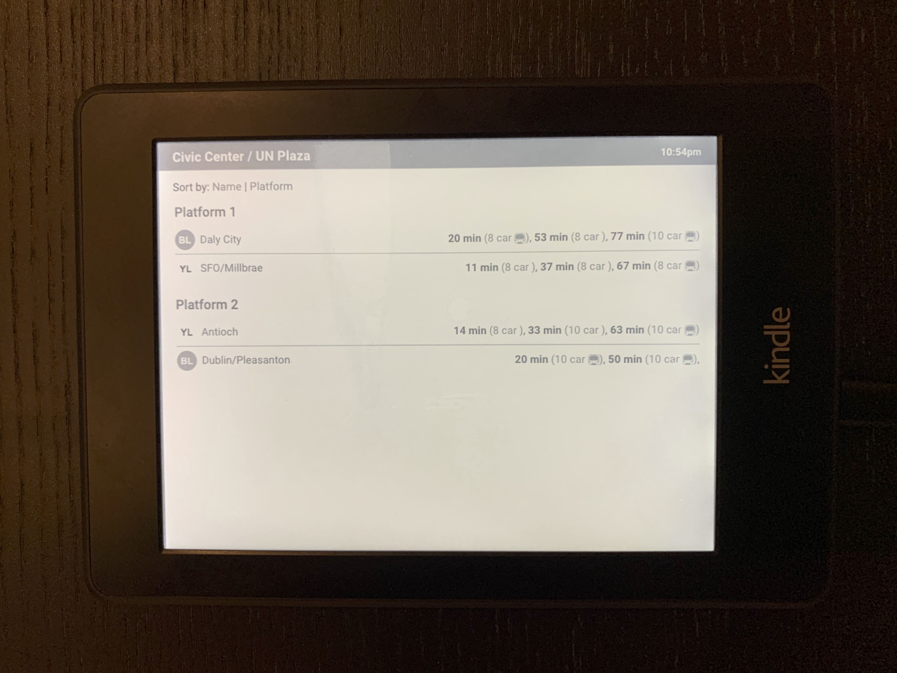


And there it is!

<div class="callout callout-success">
	<div class="callout-inner">
        <div class="callout-header">SUB-GOAL ACHIEVED!</div>
        <p>We got an image to show up on the Kindle! Remember, the key things
        were to make sure the image matches the dimensions of the Kindle
        display, and uses only 8-bit color depth.</p>
  </div>
</div>

Now that we know how to make an image show up on the Kindle, we need to build
something that will provide us with an endless stream of _useful_ images.

# Serve _useful_ images

Remember that our actual goal here is to display transit arrival times, which
aren't very helpful if you post them once and they never change. We need to
build something capable of generating Kindle-compatible screenshots if we want
this project to actually be useful. Since there was already a UI provided by
BART, I opted for the lazy approach. I built a Node.js server that used
Puppeteer to take a screenshot of the part of the page I cared about, tweaked it
to the size and color depth for the Kindle display, and returned it via an HTTP
endpoint. I put the server on a Raspberry Pi and set the Kindle up to fetch
images every minute via cron.

```sh
# On Kindle

# Add the wget/eips commands from above
$ vi /usr/bin/refresh-image
$ chmod +x /usr/bin/refresh-image

# Add the line `* * * * * /usr/bin/refresh-image`
$ vi /etc/crontab/root

# Restart the cron daemon so it runs our script
$ initctl restart cron
```

The Node.js version is very similar to the code that Matt created for his blog
post, with one notable exception. Since the BART page had auto-refreshing built
into it, I opened up a copy of the page at the beginning of the program's start
time and just let that refresh in the background instead of re-loading the page
every time an HTTP request came in. I'm not going to spend much time on the
design of this server, but if you're interested the code is up on [my
github](https://github.com/lily-mara/bart-screenshot).

<div class="callout callout-success">
	<div class="callout-inner">
        <div class="callout-header">GOAL ACHIEVED!</div>
        <p>We're successfully displaying BART departure times on a Kindle!</p>
  </div>
</div>

This system worked pretty well for a while. It would stop refreshing every once
in a while, the server would need to be restarted sometimes because it ran out
of memory, but it generally worked. It did start to break down however, once I
wanted to add support for MUNI.

# MUNI

The San Francisco Bay Area has
[27](https://www.seamlessbayarea.org/blog/transitagencieslist) (really!) transit
operators. The list of modes of transit I listed at the top of the document
wasn't a joke, we do have busses, trains, trams, trolley busses, cable cars, and
ferries, and multiple agencies that operate most of those different forms of
transit. At first my system only reported on BART, the regional rapid transit
system. Eventually though, I wanted to get arrival times for the other nearby
transit provider.

The San Francisco Municipal Railway (MUNI) operates trolley busses, gas busses,
light rail, and cable cars in San Francisco. Next to my apartment I had bus
stops and light rail stops that I frequently used and wanted to get the status
of. I thought I could adapt my Node.js screenshot tool to pull data on the MUNI
stops near me too, and I was somewhat successful at first. Like BART, MUNI has a
page where they report on the time to arrival of various lines at all of
their stops across the city.

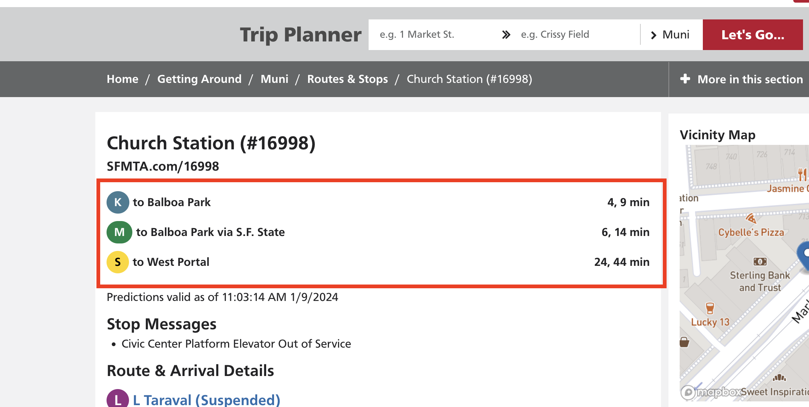

I figured it would be a straightforward endeavor to pull screenshots from the
status pages of all the stops that I cared about, and assemble them into one
view. I imagined it would look something like this:


I was able to make this by assembling some screenshots by hand in Photopea. Now
that I had a goal, I set out to it. I was able to make something that pulled in
all the screenshots by maintaining multiple open browser tabs in Puppeteer,
combining them with ImageMagick, and returning them to the Kindle. I was pretty
happy with how it looked.






This worked for a short time but it quickly became problematic. For a hint as to
why, look at the number of sections. Each of the seven sections on the image
represents a browser tab that Puppeteer needs to keep open in order to fetch
screenshots. Remember that the Node.js server was running on a Raspberry Pi, it
didn't have an excess of memory to operate in and Chrome is not known for its
svelte-ness. In a related issue, MUNI was frequently returning HTTP 429 errors
because I was fetching data from them too often. Apparently they have relatively
low rate limits on these pages. These two issues combined to mean my BART & MUNI
screens together were far less reliable than the BART one was on its own. Here's
a rare picture of both displays working in tandem.

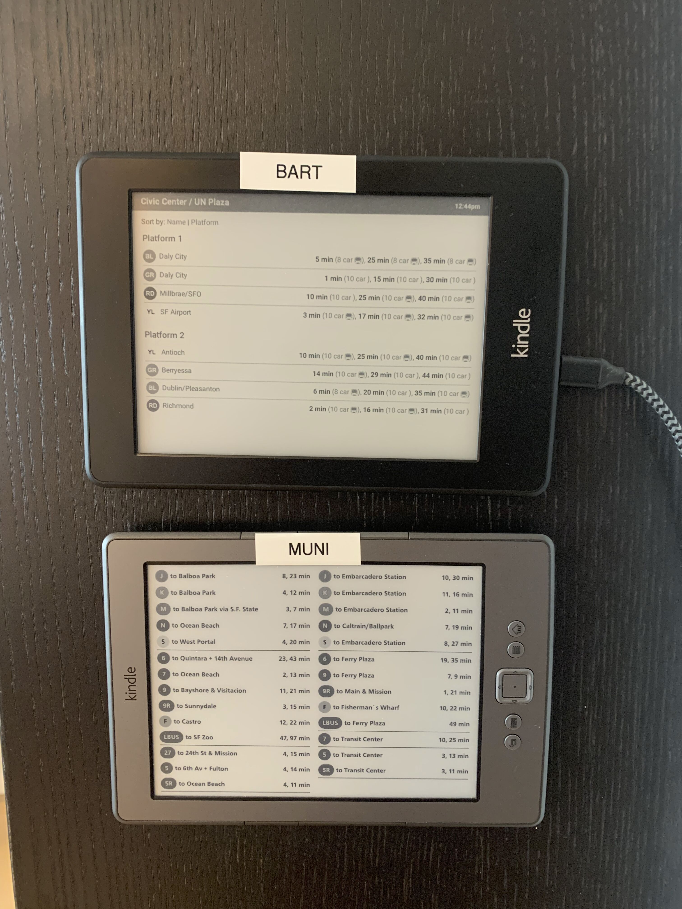

I stuck it out for a while, restarting my HTTP server when the stop data became
stale or health checks started failing. Eventually though, I grew tired of this
and realized I'd need to rethink my approach if I wanted this system to work. An
at-a-glance information system _needs_ to be reliable, otherwise what's the
point? If I can't rely on the data on the screen being accurate, it might as
well not be there. So now we begin the most beautiful process in software -
starting from scratch.

<div class="callout callout-warning">
	<div class="callout-inner">
        <div class="callout-header">goal un-achieved :(</div>
        <p>In an effort to add more functionality, we've made the system too
        resource intensive to meet its requirements and we need to start
        over.</p>
  </div>
</div>

# Starting Over From Scratch - Architecture

I picked Node.js for the first server because I was using Puppeteer. I don't
particularly like Javascript, so given the ability to start from scratch I
happily pivoted to Rust. We'll be making a Rust HTTP server with
[Axum](https://docs.rs/axum/latest/axum/) which serves PNG data. The public
contract of the service will be nearly identical to the Node.js service, but the
internals will be completely different.

We're doing away with Puppeteer, so we need to figure out how we're going to
source the data for stops. I don't particularly want to parse it out of the HTML
pages that BART & MUNI provide, and thankfully there's an API provided by 511,
the Bay Area's transit information system. Their [Stop Monitoring
API](https://511.org/open-data/transit) will give us exactly what we need - the
estimated time of upcoming arrivals at any transit stop in the Bay Area.

Next, since we're not relying on a browser engine to render the display, we will
be using a 2D graphics library to render a PNG directly. This should have a much
lower resource cost than using an entire browser engine, at the cost of some
decreased flexibility. After some brief research, I settled on using the [Rust
bindings](https://github.com/rust-skia/rust-skia) for the popular
[Skia](https://skia.org) graphics library. Skia is actually the graphics library
underpinning Chrome, so we'll be getting some of the same rendering technology
with a lot less of the bloat from Puppeteer.

<div class="callout">
	<div class="callout-inner">
        <div class="callout-header">NOTE</div>
        <p>The final server code for this project was ~1,200 lines long. I will
        <em>not</em> be explaining the entirety of the program in this blog
        post, if you'd like to go spelunking in there on your own, <a
        href="https://github.com/lily-mara/transit-kindle">here it is</a>. We will be covering the most
        important/interesting parts of the codebase but there will be
        simplifications and omissions.</p>
  </div>
</div>

There are three main components of this project. First, we'll have to find the
upcoming transit arrival times. Next, we need to be able to take these
arrival times and render them as an 8-bit PNG image. Finally (and probably the
simplest) is an HTTP server which can return the generated PNG image data.

# Getting the Data

Let's start by making sure we can pull the upcoming transit arrival times from
511.org and write them out to the console. We'll start by making a new project
with `cargo new` and defining our dependencies.

```toml
# In Cargo.toml
[dependencies]
# HTTP client crate
reqwest = { version = "0.11.18", default-features = false, features = [
    "json",

    # 511.org API responses are gzip-encoded and enabling this feature will
    # automatically decompress the payloads upon receiving them
    "gzip",

    # I used rustls because I was getting openssl linking errors on my Raspberry
    # Pi and I'm too lazy to figure out how to actually fix those, so I just
    # statically linked a TLS library. You do not have to use rustls, but if you
    # omit this line, you will need to enable some other TLS backend.
    "rustls-tls",
] }

# The de-facto standard serialization/deserialization crate for Rust, we'll
# use this to parse the 511.org response bodies.
serde = { version = "1.0.174", features = ["derive"] }

# Serde is a generic serialization framework, it doesn't know about any
# particular languages. The serde_json crate will allow us to parse JSON
# specifically.
serde_json = "1.0.103"

# Time handling library, will allow us to parse time data from strings in the
# 511.org response bodies.
chrono = { version = "0.4.26", features = ["serde"] }

# Async runtime that powers the concurrency systems our application will use -
# `full` feature required as library is shipped with only the minimum core
# functionality enabled and we need a little more than that.
tokio = { version = "1.29.1", features = ["full"] }

# Generic error reporting library
eyre = "0.6"
```

Now before we can get to coding, we need to [get an API
key](https://511.org/open-data/token) from 511.org, and take a look at the API
definition. The 511.org docs are either [not super
detailed](https://511.org/open-data/transit), or [quite
detailed](https://511.org/media/407/show), depending on which docs you check.
We'll be using the "Real-Time stop monitoring" endpoint, which the
not-super-detailed docs summarize like this:

> Real-time Stop Monitoring API provides the expected arrival and departure times of vehicles at a stop in XML and JSON formats.
>
> Endpoint: `http://api.511.org/transit/StopMonitoring?api_key=[your_key]&agency=[operatorID]`
>
> Allowable parameters: api_key (mandatory), agency (mandatory), stopcode (optional) and format (optional)

The "agency" parameter refers to the code for which of the 27 different Bay Area
transit agencies you're requesting data for. You can only get data on one agency
at a time. We're going to be pulling data for the San Francisco Municipal
Railway, which has the agency code `SF` (you can find the agency ID for other
transit agencies by using the
`https://api.511.org/transit/gtfsoperators?api_key=[your_key]` endpoint for a
list of all agencies and their IDs). The StopMonitoring endpoint either returns
upcoming arrival times for a single stop, or _all stops_ of the given transit
agency, which can be a lot of data! The 511.org APIs have a relatively low rate
limit (60 requests per hour!) so if we expect to be able to show real-time
status, we can't fetch times one stop at a time. Unfortunately, as far as I can
tell, there is no way to fetch data on multiple stops at once other than
fetching data for _all_ stops.

Ok, let's open `main.rs` and grab all of the upcoming stop times for SF MUNI!

```rust
use reqwest::Client;

#[tokio::main]
async fn main() -> eyre::Result<()> {
    let client = Client::new();

    let response = client.get("http://api.511.org/transit/StopMonitoring?api_key=[your_key]&agency=SF").send().await?.text().await?;

    println!("{response}");

    Ok(())
}
```

Now this program is going to print _a lot_ of text, let's make sure we redirect
that to a file so we can more easily explore it. This also may take a little
bit, for me the HTTP request takes around 5 seconds to complete and returns
about 27 MiB of data!

```
$ cargo run > stops.json
```

If we open the resulting JSON file and format it (my formatted JSON file is over
1 million lines long!) so that it's a bit easier to read, we can start to
understand the structure of the data that's coming back. If we extract the outer structure of the object and the first element from the ~26k item-long list, we'll see something like this:

```json
{
  "ServiceDelivery": {
    "ResponseTimestamp": "2024-01-28T18:21:20Z",
    "ProducerRef": "SF",
    "Status": true,
    "StopMonitoringDelivery": {
      "version": "1.4",
      "ResponseTimestamp": "2024-01-28T18:21:20Z",
      "Status": true,
      "MonitoredStopVisit": [
        {
          "RecordedAtTime": "2024-01-28T18:21:12Z",
          "MonitoringRef": "15918",
          "MonitoredVehicleJourney": {
            "LineRef": "29",
            "DirectionRef": "IB",
            "FramedVehicleJourneyRef": {
              "DataFrameRef": "2024-01-28",
              "DatedVehicleJourneyRef": "11493704"
            },
            "PublishedLineName": "SUNSET",
            "OperatorRef": "SF",
            "OriginRef": "14648",
            "OriginName": "Fitzgerald Ave & Keith St",
            "DestinationRef": "13706",
            "DestinationName": "Bowley St & Lincoln Blvd",
            "Monitored": true,
            "InCongestion": null,
            "VehicleLocation": {
              "Longitude": "-122.4319",
              "Latitude": "37.721199"
            },
            "Bearing": "300.0000000000",
            "Occupancy": "seatsAvailable",
            "VehicleRef": "8739",
            "MonitoredCall": {
              "StopPointRef": "15918",
              "StopPointName": "Persia Ave & Paris St",
              "VehicleLocationAtStop": "",
              "VehicleAtStop": "true",
              "DestinationDisplay": "Baker Beach",
              "AimedArrivalTime": "2024-01-28T18:21:16Z",
              "ExpectedArrivalTime": "2024-01-28T18:21:21Z",
              "AimedDepartureTime": "2024-01-28T18:21:16Z",
              "ExpectedDepartureTime": null,
              "Distances": ""
            }
          }
        }
        // ~26k other JSON objects that look basically like that
      ]
    }
  }
}
```

Now obviously, there's a whole lot of information in this response. Let's try
trimming this down to what we might need in order to render our display.
Remember that we're trying to display the upcoming arrival times for a few
lines at a few known stops. We'll filter out all of the fields that aren't
necessary for this purpose so we can focus on what counts.

```json
{
  "ServiceDelivery": {
    "StopMonitoringDelivery": {
      "MonitoredStopVisit": [
        {
          "MonitoredVehicleJourney": {
            // This is the ID of the line, in this case, we're looking at the #29 bus
            "LineRef": "29",

            // The "direction" of the bus. SF MUNI vehicles report directions
            // relative to downtown San Francisco, either "inbound" (IB) or
            // "outbound" (OB). It's a bit strange for this particular line,
            // since it goes _nowhere near downtown SF_ :/ but that's the system
            // we have. This bus is heading inbound, which means it's going West
            // from Bayview, then cutting North through the Sunset towards Baker
            // Beach.
            "DirectionRef": "IB",

            // The name of the final stop on this line in the direction that
            // this bus is headed.
            "DestinationName": "Bowley St & Lincoln Blvd",
            "MonitoredCall": {
              // This is the ID of the stop of this estimated arrival. This
              // particular stop is at Persia Ave & Paris St. in the Excelsior
              // neighborhood of SF. We will not have to map stop IDs to
              // locations for this project, but we will need to map locations
              // to Stop IDs.
              "StopPointRef": "15918",

              // This is the time that the transit agency expects this
              // particular #29 bus to reach the Persia & Paris stop.
              "ExpectedArrivalTime": "2024-01-28T18:21:21Z",

              // This is a somewhat friendlier name for the destination. We'll
              // use this but fall back to the longer one if this is
              // unavailable.
              "DestinationDisplay": "Baker Beach"
            }
          }
        }
      ]
    }
  }
}
```

Basically all of the other fields in this response are irrelevant for our
purposes. There's probably some future feature expansions that could be powered
by the other data, but for now we're going to focus on these.

Now that we have a bit of an understanding on how the data are structured, let's
filter our data by the stops that we actually care about. This step is going to
vary a bit depending on which transit operator you're using. For SF MUNI, the
stop IDs are relatively easy to figure out. The [SF MUNI
website](https://www.sfmta.com/stops/persia-ave-paris-st-15918) has realtime
stop monitoring pages, which show you the ID of the stop in question. In the
case of that link, it's the stop that we just looked at in the JSON snippet
above, #15918 at Persia & Paris. Use the MUNI website to find the IDs of the
stops close to you, paying attention to the fact that MUNI stops correspond with
only one direction of transit. This means that there are two "Persia Ave & Paris
St" stops for the #29 bus, [#15918 for
inbound](https://www.sfmta.com/stops/persia-ave-paris-st-15918) busses, and [#15919
for outbound](https://www.sfmta.com/stops/persia-ave-paris-st-15919) busses.

Now that our Rust program is going to have to start caring about the structure
of the returned JSON data, we can't just pass it around like text, we actually
need to parse it.

```rust
use reqwest::Client;
use serde::Deserialize;

#[derive(Deserialize, Debug)]
#[serde(rename_all = "PascalCase")]
struct StopMonitoringResponse {
    service_delivery: ServiceDelivery,
}

#[derive(Deserialize, Debug)]
#[serde(rename_all = "PascalCase")]
struct ServiceDelivery {
    stop_monitoring_delivery: StopMonitoringDelivery,
}

#[derive(Deserialize, Debug)]
#[serde(rename_all = "PascalCase")]
struct StopMonitoringDelivery {
    monitored_stop_visit: Vec<MonitoredStopVisit>,
}

#[derive(Deserialize, Debug)]
#[serde(rename_all = "PascalCase")]
struct MonitoredStopVisit {
    monitored_vehicle_journey: MonitoredVehicleJourney,
}

#[derive(Deserialize, Debug)]
#[serde(rename_all = "PascalCase")]
struct MonitoredVehicleJourney {
    line_ref: Option<String>,
    direction_ref: Option<String>,
    destination_name: Option<String>,
    monitored_call: MonitoredCall,
}

#[derive(Deserialize, Debug)]
#[serde(rename_all = "PascalCase")]
struct MonitoredCall {
    expected_arrival_time: Option<String>,
    stop_point_ref: String,
    destination_display: Option<String>,
}

#[tokio::main]
async fn main() -> eyre::Result<()> {
    let client = Client::new();

    let response: StopMonitoringResponse = client.get("http://api.511.org/transit/StopMonitoring?api_key=[your_key]&agency=SF&stopCode=17073,18059").send().await?.json().await?;

    let mut stops_i_care_about = Vec::new();

    for stop_visit in response
        .service_delivery
        .stop_monitoring_delivery
        .monitored_stop_visit
    {
        let stop = &stop_visit
            .monitored_vehicle_journey
            .monitored_call
            .stop_point_ref;
        if stop == "15918" || stop == "15919" {
            stops_i_care_about.push(stop_visit.monitored_vehicle_journey);
        }
    }

    println!("{stops_i_care_about:#?}");

    Ok(())
}
```

This should show us only the upcoming arrival times for the busses at both
directions of the Persia & Paris stop. Let's try running it:

```
$ cargo run > stops.txt
Error: error decoding response body: expected value at line 1 column 1

Caused by:
    expected value at line 1 column 1

Location:
    src/main.rs:48:44
```

Uh oh! For some reason, our JSON parser didn't like the value returned by the
511.org server. Was it not valid JSON? It certainly looked like valid JSON when
we looked at it. It turns out that 511.org returns a [UTF-8 Byte order
mark](https://en.wikipedia.org/wiki/Byte_order_mark#UTF-8) as the first three
bytes of its API response, something that our JSON parser is not expecting.
We'll need to remove those bytes before feeding the response to our JSON parser.

```rust
...

#[tokio::main]
async fn main() -> eyre::Result<()> {
    let client = Client::new();

    // Using the `.text()` function parses the response as UTF-8 and strips the
    // Byte order mark
    let response_txt = client.get("http://api.511.org/transit/StopMonitoring?api_key=[your_key]&agency=SF").send().await?.text().await?;

    let response: StopMonitoringResponse = serde_json::from_str(&response_txt)?;

    let mut stops_i_care_about = Vec::new();

    for stop_visit in response
        .service_delivery
        .stop_monitoring_delivery
        .monitored_stop_visit
    {
        let stop = &stop_visit
            .monitored_vehicle_journey
            .monitored_call
            .stop_point_ref;
        if stop == "15918" || stop == "15919" {
            stops_i_care_about.push(stop_visit.monitored_vehicle_journey);
        }
    }

    println!("{stops_i_care_about:#?}");

    Ok(())
}
```

Now let's try running this one more time.

```sh
$ cargo run > stops.txt
```

We should get an output file that looks something like this:

```
[
    MonitoredVehicleJourney {
        line_ref: Some(
            "29",
        ),
        direction_ref: Some(
            "IB",
        ),
        destination_name: Some(
            "Bowley St & Lincoln Blvd",
        ),
        monitored_call: MonitoredCall {
            expected_arrival_time: Some(
                "2024-01-28T19:10:40Z",
            ),
            stop_point_ref: "15918",
            destination_display: "Baker Beach"
        },
    },
    MonitoredVehicleJourney {
        line_ref: Some(
            "29",
        ),
        direction_ref: Some(
            "OB",
        ),
        destination_name: Some(
            "Fitzgerald Ave & Keith St",
        ),
        monitored_call: MonitoredCall {
            expected_arrival_time: Some(
                "2024-01-28T19:12:56Z",
            ),
            stop_point_ref: "15919",
            destination_display: "Presidio"
        },
    },
...
```

At the time I ran this, I got about 20 upcoming arrivals back. This is going to
be much more manageable than the 26k arrivals that we were initially looking at.

Let's see if we can print out the arrivals in order of soonest to latest for
each direction.

```rust
use std::collections::HashMap;
...

#[tokio::main]
async fn main() -> eyre::Result<()> {
    ...

    let mut lines_and_directions_to_arrivals = HashMap::new();
    // This will organize the data into groups based on the line ID and the
    // direction that the bus is traveling when it reaches the stop
    for arrival in stops_i_care_about {
        if let Some(line) = arrival.line_ref.clone() {
            if let Some(direction) = arrival.direction_ref.clone() {
                lines_and_directions_to_arrivals
                    .entry((line, direction))
                    .or_insert(Vec::new())
                    .push(arrival);
            }
        }
    }

    // This will sort the list of arrivals for each stop by the (lexographic)
    // order of the expected arrival time of each bus.
    for stops in lines_and_directions_to_arrivals.values_mut() {
        stops.sort_by_key(|s| s.monitored_call.expected_arrival_time.clone());
    }

    for ((line, direction), arrivals) in lines_and_directions_to_arrivals {
        println!("=======");
        println!("{line}: {direction}");
        for arrival in arrivals {
            if let Some(time) = arrival.monitored_call.expected_arrival_time {
                println!("- {}", time);
            }
        }
    }

    Ok(())
}
```

Running the code in its current form should give us something that's (nearly) usable!

```
$ cargo run
=======
29: OB
- 2024-01-28T19:31:55Z
- 2024-01-28T19:44:42Z
- 2024-01-28T19:52:49Z
- 2024-01-28T20:04:48Z
- 2024-01-28T20:16:35Z
- 2024-01-28T20:28:35Z
- 2024-01-28T20:40:35Z
- 2024-01-28T20:52:35Z
- 2024-01-28T21:04:35Z
=======
29: IB
- 2024-01-28T19:20:11Z
- 2024-01-28T19:32:42Z
- 2024-01-28T19:43:15Z
- 2024-01-28T19:55:15Z
- 2024-01-28T20:07:15Z
- 2024-01-28T20:19:15Z
- 2024-01-28T20:31:15Z
- 2024-01-28T20:43:15Z
- 2024-01-28T21:07:15Z
- 2024-01-28T21:19:15Z
- 2024-01-28T21:31:15Z
```

This technically shows us upcoming bus times, but it's not especially helpful.
Let's turn those UTC timestamps into "how many minutes away is this bus."

```rust
use chrono::prelude::*;

...

#[tokio::main]
async fn main() -> eyre::Result<()> {
    ...

    for ((line, direction), arrivals) in lines_and_directions_to_arrivals {
        println!("=======");
        println!("{line}: {direction}");
        for arrival in arrivals {
            if let Some(time) = arrival.monitored_call.expected_arrival_time {
                let time = time.parse::<DateTime<Utc>>()?;

                if time < Utc::now() {
                    continue;
                }

                println!("- {}min", (time - Utc::now()).num_minutes());
            }
        }
    }

    Ok(())
}
```

Running this gives us something pretty close to our eventual goal.

```sh
$ cargo run
=======
29: OB
- 13min
- 27min
- 42min
- 57min
- 72min
- 87min
- 102min
- 117min
=======
29: IB
- 18min
- 30min
- 59min
- 74min
- 89min
- 104min
- 124min
```

Now that we have these data, let's take a look at how we can put them into a
PNG!

# Building a PNG with Skia

Now, I'd never used Skia before, and I'd certainly never used the Skia Rust
bindings before. Before we try to display bus times, let's make sure we
understand how to set up our PNG rendering pipeline. When exploring a new
problem space, "Hello World" is usually a good first program to build. Let's
make a PNG8 image that's 1024x758 (the size of the Kindle screen) and make it
display "Hello World" in the middle of the image.

We'll need to start by including `skia-safe` in our dependencies.

```toml
# in Cargo.toml
skia-safe = "0.70"
```

Now, let's make a new binary (for the time being) that we'll use for
experimenting with Image files. I'll get us started with my (heavily annotated)
"Hello World" Skia program.

```rust
use std::{fs::File, io::Write};

use eyre::{ensure, eyre};
use skia_safe::{
    AlphaType, Bitmap, Canvas, Color4f, ColorType, Font, FontMgr, FontStyle, ImageInfo, Paint,
};

fn main() -> eyre::Result<()> {
    // A skia "bitmap" is used as an in-memory region to store all of the pixels
    // of our image. It is initially an empty 0x0 memory region.
    let mut bitmap = Bitmap::new();

    // The `ensure` macro from eyre will exit the function with an Err if this
    // `set_info` call does not return `true`.
    ensure!(
        // This `set_info` call sets up the bitmap for the dimensions and color
        // depth that we expect it to have.
        bitmap.set_info(
            &ImageInfo::new(
                // This is the width and height of the image
                (1024, 758),
                // Since color depth affects per-pixel storage, we need to set
                // this ahead of time so that Skia knows how much space (one
                // byte) to allocate for each pixel in our image.
                ColorType::Gray8,
                // Our image will have no alpha channel
                AlphaType::Unknown,
                // The colorspace of an 8-bit PNG doesn't matter that much (to
                // me at least)
                None
            ),
            None
        )
    );
    // We need to allocate the required space for our image's pixels after
    // calling `set_info`.
    bitmap.alloc_pixels();

    // A skia "canvas" is the drawing context. It is the thing that knows how to
    // draw text, 2D shapes, and everything else interesting that we care about
    // drawing. We pass our bitmap to the constructor as this is where all of
    // our image data will end up.
    let canvas = Canvas::from_bitmap(&bitmap, None).ok_or(eyre!("skia canvas"))?;

    // This call blanks the image with a fully white background. All the colors
    // we'll be dealing with are represented as 32-bit floats between 0 and 1.
    canvas.clear(Color4f::new(1.0, 1.0, 1.0, 1.0));

    // In order to draw text, we need to load a "font," which is a combination
    // of a "typeface," and a size. We'll load the "Arial" typeface and create a
    // 48-point font with it.
    let font_manager = FontMgr::new();
    let typeface = font_manager
        .match_family_style("Arial", FontStyle::normal())
        .unwrap();
    let font = Font::new(typeface, 48.0);

    // Most of the drawing commands we'll give Skia will require us to use a
    // "paint," something that tells Skia what color something should be. This
    // black paint will be used as the color of our "Hello World" text.
    let black_paint = Paint::new(Color4f::new(0.0, 0.0, 0.0, 1.0), None);

    canvas.draw_str("Hello World!", (100.0, 100.0), &font, &black_paint);

    // After drawing our image, we need to save it out to the filesystem so that
    // we can view it. First we must convert our raw bitmap into a PNG image.
    let png = bitmap
        .as_image()
        .encode(None, skia_safe::EncodedImageFormat::PNG, None)
        .ok_or(eyre!("skia image encode"))?;

    // These are the raw bytes of our PNG image. In this example, we're saving
    // the bytes to the filesystem, but in the future these bytes will be
    // streamed over an HTTP endpoint to our Kindle.
    let png_bytes = png.as_bytes();

    let mut f = File::create("out.png")?;
    f.write_all(png_bytes)?;

    Ok(())
}
```

If we run this binary and open the generated `out.png` file, we should see our
message!

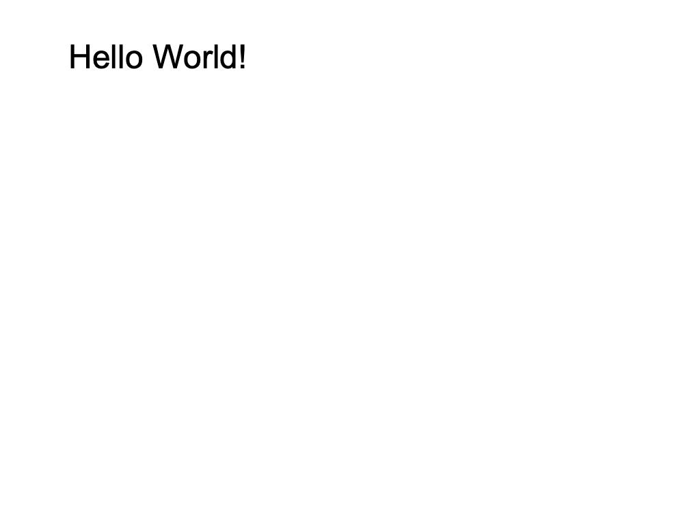

Now that we can render some text, let's try to render some bus times instead.
We'll aim to create a table-like display with a column for inbound vehicles and
another for outbound vehicles. Each row in the table will represent a line in a
particular direction. I'm going to make some fake times, in the interest of
fast iteration time (remember it's rather slow to fetch data from the 511.org
API, and there's also a low rate limit).

```rust
fn main() -> eyre::Result<()> {
    ...

    // These contain line IDs, Destination names, and lists of times of upcoming
    // buses/trains.
    let inbound_bus_times: &[(&str, &str, &[&str])] = &[
        ("22", "Marina", &["5min", "7min"]),
        ("K", "Embarcadero", &["3min", "10min"]),
        ("J", "Downtown", &["0min", "8min", "13min"]),
    ];
    let outbound_bus_times: &[(&str, &str, &[&str])] = &[
        ("22", "UCSF", &["3min", "9min"]),
        ("K", "Balboa Park", &["12min", "20min"]),
        ("J", "Balboa Park", &["1min", "127min", "128min"]),
    ];

    // Since we have two sets of times to render, we'll create a lambda that
    // allows us to run the same code against two different sets of inputs - the
    // two different sets of times, and the left and right column of the image.
    let draw_times = |times: &[(&str, &str, &[&str])], x1: f32, x2: f32| {
        let mut y = 30.0;
        for (line_id, destination, times) in times {
            canvas.draw_str(line_id, (x1 + 20.0, y), &font, &black_paint);

            canvas.draw_str(destination, (x1 + 60.0, y), &font, &black_paint);

            let mut times_str = String::new();
            for time in *times {
                times_str.push_str(time);
                times_str.push_str(", ");
            }
            times_str.pop();
            times_str.pop();

            canvas.draw_str(times_str, (x1 + 260.0, y), &font, &black_paint);
            canvas.draw_line((x1 + 10.0, y + 10.0), (x2 - 10.0, y + 10.0), &black_paint);
            y += 40.0;
        }
    };

    let width = 1024.0;
    let height = 758.0;
    let midpoint = 512.0;

    draw_times(inbound_bus_times, 0.0, midpoint);
    canvas.draw_line((midpoint, 0.0), (midpoint, height), &black_paint);
    draw_times(outbound_bus_times, midpoint, width);

    ...
}
```

There's not really a whole lot that's new to us in this code example except for
the `draw_line` function. We're using it to put a line underneath each
bus/train's next arrival times, and in the middle of the image to divide the two
columns. It's all just loops and setting text on the image. Running this
program, we get a functional (if quite stale) display of times.


Now that we're displaying an image, let's see if we can connect our API fetching
code to the PNG generation code.

# Building a PNG backed by data

In order to accomplish this, we're going to need to change some of the data
structures we're using to hold the journeys to more closely align with what our
image generation code needs. Remember that the image generation code is
expecting data broken down by direction, line ID, line destination, and then
times. I'm also going to switch the data from the sleepy Prussia & Paris stop to
a few stops located at Van Ness and Market, one of MUNI's busiest
interconnection spots (anecdotally). Let's start with these changes before we
add in the image generation.

```rust
#[tokio::main]
async fn main() -> eyre::Result<()> {
    let client = Client::new();

    let response_txt = client.get("http://api.511.org/transit/StopMonitoring?api_key=[your_key]&agency=SF").send().await?.text().await?;

    let response: StopMonitoringResponse = serde_json::from_str(&response_txt)?;

    let mut journeys_i_care_about = Vec::new();

    for stop_visit in response
        .service_delivery
        .stop_monitoring_delivery
        .monitored_stop_visit
    {
        let stop = &stop_visit
            .monitored_vehicle_journey
            .monitored_call
            .stop_point_ref;
        // These four stop IDs represent IB/OB traffic at the Van Ness Metro
        // stop, and East/West traffic on Market St at Van Ness.
        if ["15419", "16996", "15692", "15696"].contains(&stop.as_ref()) {
            journeys_i_care_about.push(stop_visit.monitored_vehicle_journey);
        }
    }

    // The name is a little unwieldy, but this layered HashMap holds journeys
    // organized first by direction (IB/OB), then a combination of line ID &
    // destination name.
    let mut directions_to_lines_destinations_to_journeys = HashMap::new();
    for journey in journeys_i_care_about {
        let Some(line) = journey.line_ref.clone() else {
            continue;
        };
        let Some(direction) = journey.direction_ref.clone() else {
            continue;
        };
        let Some(destination) = journey.monitored_call.destination_display.clone() else {
            continue;
        };

        directions_to_lines_destinations_to_journeys
            .entry(direction)
            .or_insert(HashMap::new())
            .entry((line, destination))
            .or_insert(Vec::new())
            .push(journey);
    }

    for lines_destinations_to_journeys in directions_to_lines_destinations_to_journeys.values_mut()
    {
        for journeys in lines_destinations_to_journeys.values_mut() {
            journeys.sort_by_key(|j| j.monitored_call.expected_arrival_time.clone());
        }
    }

    // We'll worry about this function later
    draw_image(directions_to_lines_destinations_to_journeys)?;

    Ok(())
}
```

Now that we have the data prepped, let's make the changes to our image
generation to support live data.

```rust
fn draw_image(
    directions_to_lines_destinations_to_journeys: HashMap<
        String,
        HashMap<(String, String), Vec<MonitoredVehicleJourney>>,
    >,
) -> eyre::Result<()> {
    let mut bitmap = Bitmap::new();
    ensure!(bitmap.set_info(
        &ImageInfo::new((1024, 758), ColorType::Gray8, AlphaType::Unknown, None),
        None
    ));
    bitmap.alloc_pixels();

    let canvas = Canvas::from_bitmap(&bitmap, None).ok_or(eyre!("skia canvas"))?;

    canvas.clear(Color4f::new(1.0, 1.0, 1.0, 1.0));

    let font_manager = FontMgr::new();
    let typeface = font_manager
        .match_family_style("Arial", FontStyle::normal())
        .unwrap();
    let font = Font::new(typeface, 24.0);

    let black_paint = Paint::new(Color4f::new(0.0, 0.0, 0.0, 1.0), None);

    let inbound_journeys = &directions_to_lines_destinations_to_journeys["IB"];
    let outbound_journeys = &directions_to_lines_destinations_to_journeys["OB"];

    let draw_times = |lines_destinations_to_journeys: &HashMap<
        (String, String),
        Vec<MonitoredVehicleJourney>,
    >,
                      x1: f32,
                      x2: f32| {
        let mut y = 30.0;
        for ((line_id, destination), journeys) in lines_destinations_to_journeys {
            canvas.draw_str(line_id, (x1 + 20.0, y), &font, &black_paint);

            canvas.draw_str(destination, (x1 + 60.0, y), &font, &black_paint);

            let mut times_str = String::new();
            for journey in journeys {
                let Some(time_str) = &journey.monitored_call.expected_arrival_time else {
                    continue;
                };

                let Ok(time) = time_str.parse::<DateTime<Utc>>() else {
                    continue;
                };

                if time < Utc::now() {
                    continue;
                }

                let time = format!("{}min, ", (time - Utc::now()).num_minutes());

                times_str.push_str(&time);
            }
            times_str.pop();
            times_str.pop();

            canvas.draw_str(times_str, (x1 + 260.0, y), &font, &black_paint);
            canvas.draw_line((x1 + 10.0, y + 10.0), (x2 - 10.0, y + 10.0), &black_paint);
            y += 40.0;
        }
    };

    let width = 1024.0;
    let height = 758.0;
    let midpoint = 512.0;

    draw_times(inbound_journeys, 0.0, midpoint);
    canvas.draw_line((midpoint, 0.0), (midpoint, height), &black_paint);
    draw_times(outbound_journeys, midpoint, width);

    let png = bitmap
        .as_image()
        .encode(None, skia_safe::EncodedImageFormat::PNG, None)
        .ok_or(eyre!("skia image encode"))?;
    let png_bytes = png.as_bytes();

    let mut f = File::create("out.png")?;
    f.write_all(png_bytes)?;

    Ok(())
}
```

There's a little bit more logic in there now, but it's basically the same as the
previous standalone image generator. Let's run our program and get a beautiful,
accurate timetable of the Van Ness busses and trams!

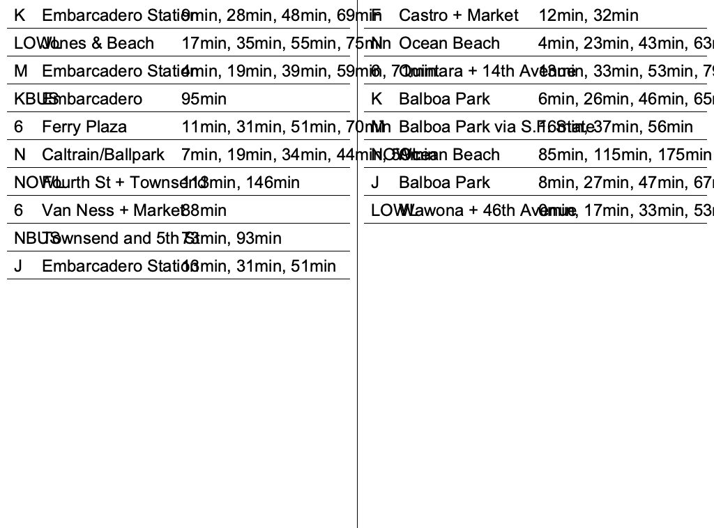

Uh oh. Now, absolutely nobody in the world could have predicted this, but our
real-world data were more complicated than the test data that I thought up while
I was heavily biased towards "I don't want to type very much." The main issue
here is that we have a static layout for each of our rows, despite the fact that
there's a slightly different amount of data to display in each of the rows.
We're going to have to do a little bit of _visual design_, but before we do let's add
a little short-circuit to the API-calling code so that we can iterate on this
quickly and not get rate-limited.

```rust
#[tokio::main]
async fn main() -> eyre::Result<()> {
    let response_txt = match std::fs::read_to_string("data.json") {
        Ok(x) => x,
        Err(_) => {
            let client = Client::new();

            let data = client.get("http://api.511.org/transit/StopMonitoring?api_key=[your_key]&agency=SF").send().await?.text().await?;
            std::fs::write("data.json", &data)?;
            data
        }
    };

    let response: StopMonitoringResponse = serde_json::from_str(&response_txt)?;
    ...
```

Now then, here's how we're going to update the drawing:

- Right-justify the times of upcoming vehicles so that there's no wasted space
  at the end of the timetables
- Remove the "min" between each time on the table, adding it only at the end of
  the list. This maximizes useful information and minimizes cruft
- Only display the next 3 vehicles, we don't have space for all of them
- Scoot the destination names a bit to the right to compensate for the longer
  bus names

Let's start with these three changes and see how far that gets us. The
`draw_times` lambda in `draw_image` is really the only thing that needs to
change.

```rust
let draw_times = |lines_destinations_to_journeys: &HashMap<
    (String, String),
    Vec<MonitoredVehicleJourney>,
>,
                    x1: f32,
                    x2: f32| {
    let mut y = 30.0;
    for ((line_id, destination), journeys) in lines_destinations_to_journeys {
        canvas.draw_str(line_id, (x1 + 20.0, y), &font, &black_paint);

        canvas.draw_str(destination, (x1 + 90.0, y), &font, &black_paint);

        let mut times_str = String::new();
        for journey in &journeys[..journeys.len().min(3)] {
            let Some(time_str) = &journey.monitored_call.expected_arrival_time else {
                continue;
            };

            let Ok(time) = time_str.parse::<DateTime<Utc>>() else {
                continue;
            };

            if time < Utc::now() {
                continue;
            }

            let time = format!("{}, ", (time - Utc::now()).num_minutes());

            times_str.push_str(&time);
        }
        times_str.pop();
        times_str.pop();
        times_str.push_str(" min");

        canvas.draw_str_align(times_str, (x2 - 20.0, y), &font, &black_paint, Align::Right);
        canvas.draw_line((x1 + 10.0, y + 10.0), (x2 - 10.0, y + 10.0), &black_paint);
        y += 40.0;
    }
};
```

After this, we can re-run the program and get a much more legible (if quite
bland and odd) timetable.


This isn't a great looking timetable, and it's not what the finished product is
going to look like, but it is what we're going to start out with. Now that we
can generate a PNG with real image data, let's move on to serving it via HTTP.

# Serving the PNG with Axum

Now that we can generate a PNG, let's build a server that can feed our image
file to the Kindle. We'll need to add Axum to our dependency list.

```toml
# In Cargo.toml
axum = "0.7"
```

And thankfully, this is about the easiest part of the project to build. Let's
start by writing an HTTP server with a handler for our PNG file, and make that
handler return an empty body.

```rust
use axum::{
    body::{Body, Bytes},
    http::StatusCode,
    response::Response,
    routing::get,
    Router,
};
use tokio::net::TcpListener;

#[tokio::main]
async fn main() -> eyre::Result<()> {
    let app = Router::new().route("/stops.png", get(handle_stops_png));

    let listener = TcpListener::bind(&"0.0.0.0:3001").await?;

    eprintln!("Visit http://localhost:3001/stops.png");

    axum::serve(listener, app.into_make_service()).await?;

    Ok(())
}

async fn handle_stops_png() -> Response<Body> {
    Response::builder()
        .status(StatusCode::OK)
        .header("Content-Type", "image/png")
        .body(Body::from(Bytes::from(&[])))
        .unwrap()
}
```

Running this server with `cargo run` and visiting
`http://localhost:3001/stops.png` in your browser won't return any content, but
it should respond with a HTTP 200. Now let's connect our HTTP server with the
image generation code. We need to make some subtle changes to that code so that
image data gets passed around in memory instead of being written to a file.

```rust
...

async fn handle_stops_png() -> Response<Body> {
    Response::builder()
        .status(StatusCode::OK)
        .header("Content-Type", "image/png")
        .body(Body::from(Bytes::from(get_image().await.unwrap())))
        .unwrap()
}

// This used to be the `main` function when the program was just saving images
// to disk, notice that the return type has changed
async fn get_image() -> eyre::Result<Vec<u8>> {
    let response_txt = match std::fs::read_to_string("data.json") {
    ...

    let png_bytes = draw_image(directions_to_lines_destinations_to_journeys)?;

    Ok(png_bytes)
}

// Notice that the return type of this function has changed
fn draw_image(
    directions_to_lines_destinations_to_journeys: HashMap<
        String,
        HashMap<(String, String), Vec<MonitoredVehicleJourney>>,
    >,
) -> eyre::Result<Vec<u8>> {
    ...

    let png_bytes = png.as_bytes();

    // Recall that previously these bytes were written to a file instead of
    // being returned from the function.
    Ok(png_bytes.to_owned())
}
```

If we run this server and visit the image page in our browser, we should see our
beautiful schedule!


If we try to display this on our Kindle by fetching it via `wget` and displaying
it via `eips`, we'll be disappointed to see that the image is rotated and cut
off. Of course the Kindle is designed to be held in portrait orientation, so we
need to manually rotate our image to landscape orientation if we want it to
display correctly. This can be done by applying a rotation matrix before we
begin drawing.

```rust
let mut bitmap = Bitmap::new();
ensure!(bitmap.set_info(
    // Notice that the dimensions we're using for width and height have been flipped here
    &ImageInfo::new((758, 1024), ColorType::Gray8, AlphaType::Unknown, None),
    None
));
bitmap.alloc_pixels();

let canvas = Canvas::from_bitmap(&bitmap, None).ok_or(eyre!("skia canvas"))?;
// The point we're rotating around is (width/2, width/2)
canvas.rotate(90.0, Some(Point::new(379.0, 379.0)));
```

This should return a rotated image that displays correctly on the Kindle.
Images in the rest of this post will be displayed in landscape orientation for
ease of viewing.

Now that we have something that works end-to-end, let's improve the layout of
our schedule a bit.

<div class="callout callout-success">
	<div class="callout-inner">
        <div class="callout-header">GOAL RE-ACHIEVED!</div>
        <p>We now have an HTTP server that can render upcoming transit arrival times in a format that our Kindle can digest. It's important to recognize that the project is perfectly usable as it is right now (if you remove the "cache all the data forever" bit), and all of the further work that we're going to look at is <em>enhancement</em>. Something doesn't need to be beautiful to be functional, but it is nice when things are beautiful.</p>
  </div>
</div>

# Refining the UI

Now our schedule may be, strictly speaking, usable. But it's not what I'd call
beautiful. Despite our spacing efforts, text can still overlay each other, and
the most important things don't look the most important. Let's start by doing
something that sounds simple (but actually isn't). Let's put the Line ID in a
nice little bubble so that it stands out.

We're going to do this by first making a helper function that can tell us how
big a given piece of text is expected to be, based on the font and the paint
that we're going to use to render it.

```rust
use skia_safe::{
    utils::text_utils::Align, AlphaType, Bitmap, Canvas, Color4f, ColorType, Font, FontMgr,
    FontStyle, ImageInfo, Paint, Rect,
};

...

fn text_bounds(text: &str, (x, y): (f32, f32), font: &Font, paint: &Paint) -> Rect {
    let (text_width, text_measurements) = font.measure_str(text, Some(paint));
    // It took me a few tries to figure out exactly how to make use of the
    // `measure_str` method, but this gives us a bounding box on the exact size
    // of whatever text we input.
    Rect::new(x, y + text_measurements.top, x + text_width, y)
}
```

Next, we'll use this method to draw a rounded rectangle, slightly larger than
the line ID.

```rust
...
fn draw_image(
    directions_to_lines_destinations_to_journeys: HashMap<
        String,
        HashMap<(String, String), Vec<MonitoredVehicleJourney>>,
    >,
) -> eyre::Result<Vec<u8>> {
    ...
    let black_paint = Paint::new(Color4f::new(0.0, 0.0, 0.0, 1.0), None);
    // We need a new paint, since we want our bubble to be a light grey color so
    // that it shows up behind the black text
    let line_id_bubble_paint = Paint::new(Color4f::new(0.8, 0.8, 0.8, 1.0), None);

    ...

    let draw_times = |...| {
        for ((line_id, destination), journeys) in lines_destinations_to_journeys {
            let bounds = text_bounds(
                line_id,
                (x1 + 20.0, y),
                &font,
                &line_id_bubble_paint,
            )
            .with_outset((8.0, 8.0));
            canvas.draw_round_rect(bounds, 24.0, 24.0, &line_id_bubble_paint);
            canvas.draw_str(line_id, (x1 + 20.0, y), &font, &black_paint);

            ...
        }
    };

    ...
}

```

Also, now that we know the exact X-coordinate where our Line ID (and associated
bubble) will end, we can use this to place the destination string with exactly
15 pixels of padding room.

```rust
canvas.draw_str(destination, (bounds.right + 15.0, y), &font, &black_paint);
```

These two small changes produce something that already looks leagues better.


The last change that we'll look at in detail here is to add column headers to
the page.

We'll accomplish this by drawing a light grey rectangle at the top of the page,
then writing our column IDs inside the two halves of that rectangle,
center-aligned. We'll also need to adjust the starting value for `y` in our
`draw_times` function to `60.0` to compensate for the new top of the image.

```rust
...
let width = 1024.0;
let height = 758.0;
let midpoint = 512.0;

canvas.draw_rect(Rect::new(0.0, 0.0, width, 30.0), &line_id_bubble_paint);
canvas.draw_str_align(
    "Muni Inbound",
    (midpoint / 2.0, 23.0),
    &font,
    &black_paint,
    Align::Center,
);
canvas.draw_str_align(
    "Muni Outbound",
    (midpoint + midpoint / 2.0, 23.0),
    &font,
    &black_paint,
    Align::Center,
);
canvas.draw_line((0.0, 30.0), (width, 30.0), &black_paint);

draw_times(inbound_journeys, 0.0, midpoint);
...
```

Running this now, we get something that looks (I think) quite serviceable.


I did do more refinements after this, but I'm not going to discuss them in
detail in this blog post.

Now that we have the image sorted, making a deployable version of this server is
just a matter of removing the "cache the data forever" code that's at the top of
the HTTP handler.

```rust
async fn get_image() -> eyre::Result<Vec<u8>> {
    let client = Client::new();

    let response_txt = client.get("http://api.511.org/transit/StopMonitoring?api_key=[your_key]&agency=SF").send().await?.text().await?;
    let response: StopMonitoringResponse = serde_json::from_str(&response_txt)?;
    ...
}
```

# Fin.

And that's all I'm gonna cover in this one! This is the longest blog post I've
ever written (it's longer than some of the chapters of [my
book](https://lilymara.xyz/posts/refactoring-to-rust/)!). This project has been
in flight for a very long time. The BART-screenshot-powered version of this
Kindle project was working around February of 2023, and I put the final UI
polish on the Rust rewrite in January 2024. There are a few things that I didn't
cover in here because it just seemed like the post was getting long enough as it
is:

- The caching system that fetched API data continuously in the background so
  that the HTTP server is very fast
- Extra pieces of the UI - time in the lower left corner and data cache status
  in the lower right corner
- Anti-aliasing
- Cutting off destination names if they stretch into the arrival time area so
  the strings don't overlap (with gradient!)
- Setting different grey colors for each of the lines so that they can be
  slightly more quickly distinguished
- Making the whole thing config file driven
- Error-handling - the real version of the server will return a PNG file
  displaying the error and it's `.source()` chain, so that it's clearly
  visible on the Kindle

Something that might not be obvious to people that haven't done this kind of
writing is that you basically have to re-do the project in slow motion when you
write a post like this (unless you're writing the blog post as you're
prototyping, but I wouldn't recommend that). The steps that we took in building
up the UI were different than the steps that I took when building it myself,
because it took me a while to figure out the right way to do things. Here are
some of the intermediate states that I took when building the UI, along with the
final current state.


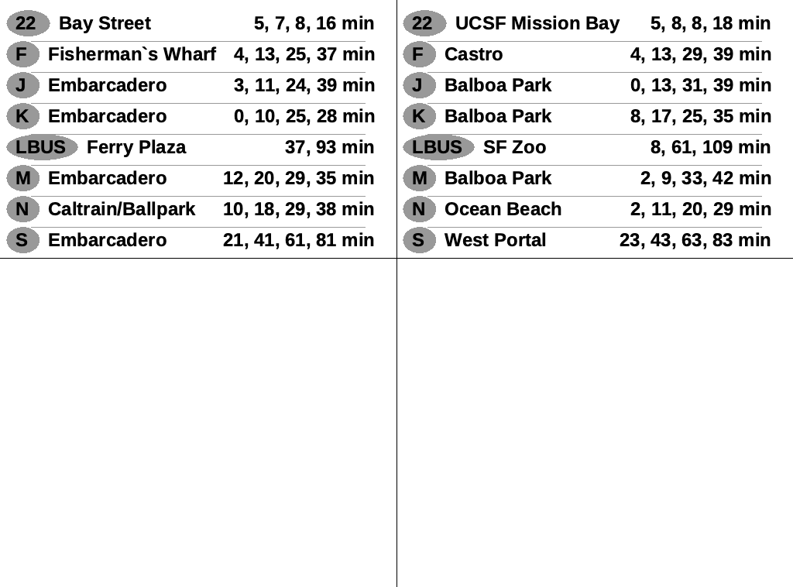




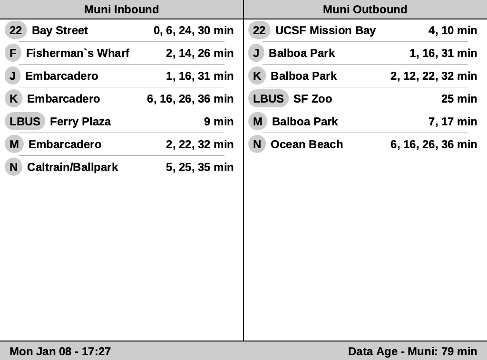




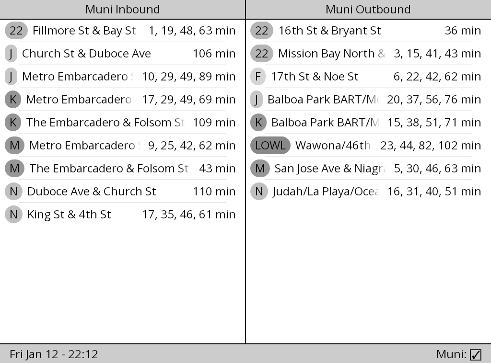
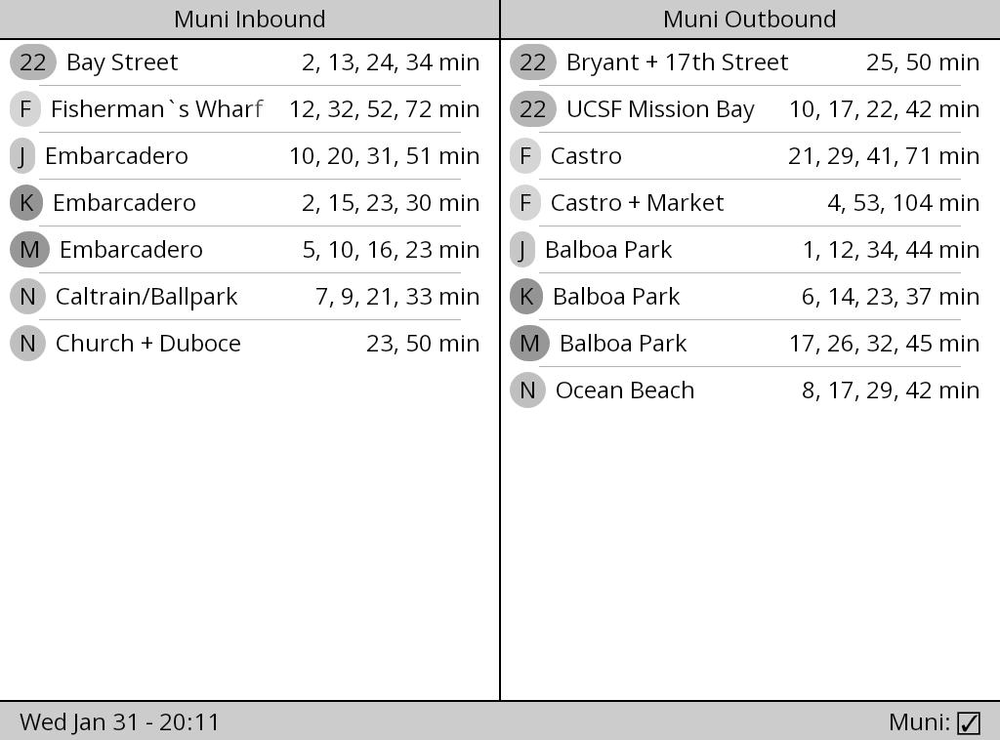


The final (simplified) code for the server we built together is on my github
[here](https://github.com/lily-mara/transit-kindle-simplified), and the server
that I actually use to power the Kindle on my wall is
[here](https://github.com/lily-mara/transit-kindle). Thanks for reading!

<div class="callout">
	<div class="callout-inner">
        <div class="callout-header">AD</div>
        <p>Writing this post was a lot of work. I don't have any tracking, sponsorships, or (real) ads on this website. I just write because I like sharing things with people. If you liked this blog post and you'd like to show your appreciation, please consider making a donation to <a href="https://translifeline.org">Trans Lifeline</a> or <a href="https://www.eqfl.org">Equality Florida</a>. The country is <a href="https://www.erininthemorning.com/p/erins-anti-trans-risk-map-early-legislative">scary</a> right now for trans people, with Florida (and more recently Utah) passing some of the more draconian laws.</p>
  </div>
</div>
