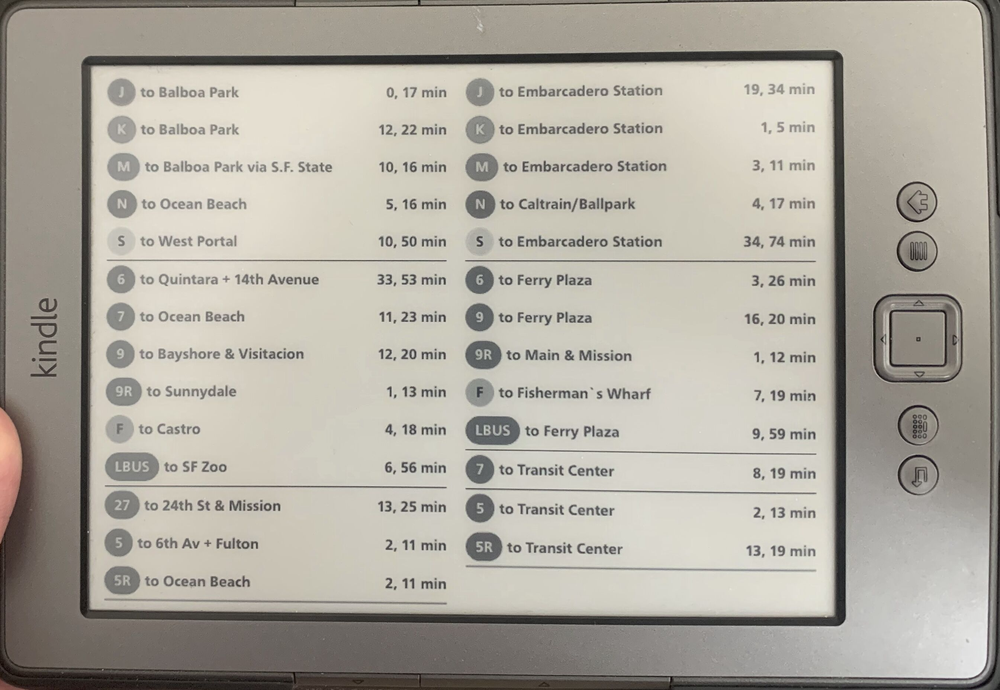

- TODO: re-number the sections when completed
- TODO: shrink the images so the page isn't ~100MB

I live in San Francisco, and I don't own a car. This means that I walk or take
public transit nearly everywhere that I go. There's a lot of ways to find out
when the next bus/train/tram/trolleybus/cable car/ferry is stopping nearby so
that you don't miss it. There are no shortage of apps that will guide you to
your destination using any and all means of public transit, and those are great!
I particularly like [CityMapper](https://citymapper.com). But apps aren't always
the best for getting around a city, especially for leaving your own apartment.

The most frustrating thing about these transit apps is that they assume that
they're going to guide you through the entire transit process. They often work
on the "where are you and where are you going" model of something like Google
Maps. This is great for people new to a city, or exploring a new area of the
city, they can get all the guidance they need. But when I'm leaving from my own
apartment, I know where the closest transit stops are and where they go. I don't
need an app to tell me _which_ line to take to go downtown, I really just need
to know _when_ each transit line has an upcoming train/tram/bus. These goals are
at odds with the goals of a general-purpose navigation app that's somewhat
useful to everyone in a broad range of circumstances, so like most truly useful
things we need to build it ourselves.

I was first inspired to build this project after reading [Matt Healy's 2021 blog
post](https://matthealy.com/kindle) on building a smart home display with a
Kindle. Matt used an old Kindle to display things like weather, calendar events,
meal plans, and house cleaning schedules. I figured I could probably adapt his
guide and make myself an always-available display of upcoming transit departures
at the stops nearest to my apartment. Just today, I also saw [Ben Borgers'
post](https://ben.page/eink) about using an old Nook as an iCloud photo frame.
These devices are super cool, and can be had for quite cheap. I had a few old
Kindles lying around collecting dust, and I was excited at the prospect of using
them for something productive again.

<div class="callout">
	<div class="callout-inner">
        <div class="callout-header">GOAL</div>
        <p>Display upcoming transit departure times on a Kindle</p>
  </div>
</div>

# Jailbreaking your Kindle

The first step is to jailbreak your Kindle. I'm not going to detail the steps
required to accomplish this here, there are numerous guides out there. The
[mobileread
wiki](https://wiki.mobileread.com/wiki/Kindle_Hacks_Information#Jail_break_JB)
and forums were an invaluable resource during this process. The main goal here
is to enable USBNet, this will give us the ability to SSH into the kindle, which
we will use to set up the cron job that updates the display.

- [Jailbreak](https://www.mobileread.com/forums/showthread.php?t=346037&highlight=wifi)
- [All hacks](https://www.mobileread.com/forums/showthread.php?t=225030)
  - [Launcher](https://www.mobileread.com/forums/showthread.php?t=203326)
  - [Package installer](https://www.mobileread.com/forums/showthread.php?t=251143)
  - Usbnet - enabled via the package installer
  - [Setting up usbnet in macOS](https://www.mobileread.com/forums/showpost.php?p=2895606&postcount=13)

# Get an Image on the Kindle

Now that the Kindle is jailbroken, I set out trying to get some image to display
on the Kindle. It was no use setting up a system to automatically build the
images for showing on the Kindle if I couldn't first get _something_ on there to
show up in a readable state. This was much more of an adventure than I was
expecting.

<div class="callout">
	<div class="callout-inner">
        <div class="callout-header">SUB-GOAL</div>
        <p>Display <em>some</em> image on the Kindle</p>
  </div>
</div>

First, I identified the image that I wanted to Display. Thankfully, BART (the
main transit agency that I used at the time I started the project) has a website
that provided basically exactly what I wanted. BART's [Real Time
Departure](https://www.bart.gov/schedules/eta/CIVC) page shows all of the
upcoming trains at whatever station you want, and it even refreshes itself in
the background.


I grabbed a screenshot of the central area of the page, which seems almost
designed to be a standalone dashboard, transferred it to the Kindle, and
attempted to display it. The Kindle CLI has a tool that can be used to display
image files easily.

```sh
# On laptop
$ python3 -m http.server

# On Kindle
$ wget 192.168.50.28:8000/bart-screenshot.png
# Clear the e-ink display
$ eips -c
# Display the PNG file on the display
$ eips -g bart-screenshot.png
```

After attempting to display my screenshot, it was apparent that it wouldn't be
quite so simple.





The image was stretched to such an extreme extent that it was unusable. I went
back to the drawing board. I created a "calibration image" in
[Photopea](https://photopea.com), my image editor of choice, and set out trying
to figure out where I went wrong. The image was the exact size of my Kindle's
display - 1024x758. After displaying the image on my Kindle, I started to piece
together what might be going on. Take a look at the expected PNG image, and what
actually showed up on the Kindle display:






Based on the stretch of the image, and the fact that the image seemed to cut off
around 33% of the way through the x-axis, I tried shrinking the image's
horizontal dimension to 1/3, so it was now 1024x252. This provided _slightly_
better results, but something was still very clearly wrong.






I noticed this time that the image appeared to be un-stretched, but it didn't
fill the entire screen. I reasoned that the Kindle must be displaying only the
pixels that fell within the bounds reported in the PNG metadata. I created
another calibration image which had the full size of the Kindle display, but
only put data in the left 33% of it. This was the most promising result yet.






I applied this "empty space & stretching" technique to my BART screenshot, and
displayed it on the page. initially, this looked very promising. On closer
inspection however, I was disappointed.


The image appeared extremely pixelated on the Kindle display. Notice in the
image that the text "Kindle" on the frame is very clear, the pixelation on the
display is _not_ because of the camera, it is an issue with the display.

Matt Healy had helpfully linked to the code he was using to drive his Kindle
display, and I figured he must have figured this issue out if his Kindle was
working correctly. I looked through his Node.js code and quickly found [this
critical
function](https://github.com/lankybutmacho/web-to-kindle-heroku/blob/2a9473f30c71a257931927aa0af73bd16bd800a3/index.js#L36C1-L48C2):

```js
function convert(filename) {
  return new Promise((resolve, reject) => {
    const args = [
      filename,
      "-gravity",
      "center",
      "-extent",
      "600x800",
      "-colorspace",
      "gray",
      "-depth",
      "8",
      filename,
    ];
    execFile("convert", args, (error, stdout, stderr) => {
      if (error) {
        console.error({ error, stdout, stderr });
        reject();
      } else {
        resolve();
      }
    });
  });
}
```

He feeds his screenshots into [ImageMagick](https://imagemagick.org/index.php)'s
`convert` utility and does a few things with them, but of particular note are
these arguments

```sh
-colorspace gray -depth 8
```

Of course! I was feeding a 24-bit (3 channel RGB) PNG image into the Kindle's
software, but the Kindle has only a greyscale screen, so they never bothered to
add support for 24-bit PNG files. The "normal" image appears stretched because
as far as the Kindle is concerned, all of the pixels are triplicated, it just
naively reads image data out of the PNG blob and assumes it's an 8-bit image. It
cut off the 1/3 width image partway through the display because the width
metadata on the image made the Kindle think it should only render it over 1/3 of
the screen. The 1/3 width data, full-width metadata image works but looks poor
because 1/3 of the resolution is being sacrificed. After using `convert` to turn
my screenshot into an 8-bit PNG image, it displays correctly on the Kindle.


Now that I can display an image that looks alright, I padded the image so that
it would fully fit within the viewport of the Kindle and re-displayed it.






And there it is!

<div class="callout callout-success">
	<div class="callout-inner">
        <div class="callout-header">SUB-GOAL ACHIEVED!</div>
        <p>We got an image to show up on the Kindle! Remember, the key things
        were to make sure the image matches the dimensions of the Kindle
        display, and uses only 8-bit color depth.</p>
  </div>
</div>

Now that we know how to make an image show up on the Kindle, we need to build
something that will provide us with an endless stream of _useful_ images.

# Serve _useful_ images

Remember that our actual goal here is to display transit departure times, which
aren't very helpful if you post them once and they never change. We need to
build something capable of generating Kindle-compatible screenshots if we want
this project to actually be useful. Since there was already a UI provided by
BART, I opted for the lazy approach. I built a Node.js server that used
Puppeteer to take a screenshot of the part of the page I cared about, tweaked it
to the size and color depth for the Kindle display, and returned it via an HTTP
endpoint. I put the server on a Raspberry Pi and set the Kindle up to fetch
images every minute via cron.

The Node.js version is very similar to the code that Matt created for his blog
post, with one notable exception. Since the BART page had auto-refreshing built
into it, I opened up a copy of the page at the beginning of the program's start
time and just let that refresh in the background instead of re-loading the page
every time an HTTP request came in. I'm not going to spend much time on the
design of this server, but if you're interested the code is up on [my
github](https://github.com/lily-mara/bart-screenshot).

<div class="callout callout-success">
	<div class="callout-inner">
        <div class="callout-header">GOAL ACHIEVED!</div>
        <p>We're successfully displaying BART departure times on a Kindle!</p>
  </div>
</div>

This system worked pretty well for a while. It would stop refreshing every once
in a while, the server would need to be restarted sometimes because it ran out
of memory, but it generally worked. It did start to break down however, once I
wanted to add support for MUNI.

# MUNI

The San Francisco Bay Area has
[27](https://www.seamlessbayarea.org/blog/transitagencieslist) (really!) transit
operators. The list of modes of transit I listed at the top of the document
wasn't a joke, we do have busses, trains, trams, trolley busses, cable cars, and
ferries, and multiple agencies that operate most of those different forms of
transit. At first my system only reported on BART, the regional rapid transit
system. Eventually though, I wanted to get departure times for the other nearby
transit provider.

The San Francisco Municipal Railway (MUNI) operates trolley busses, gas busses,
light rail, and cable cars in San Francisco. Next to my apartment I had bus
stops and light rail stops that I frequently used and wanted to get the status
of. I thought I could adapt my Node.js screenshot tool to pull data on the MUNI
stops near me too, and I was somewhat successful at first. Like BART, MUNI has a
page where they report on the time to departures of various lines at all of
their stops across the city.


I figured it would be a straightforward endeavor to pull screenshots from the
status pages of all the stops that I cared about, and assemble them into one
view. I imagined it would look something like this:


I was able to make this by assembling some screenshots by hand in Photopea. Now
that I had a goal, I set out to it. I was able to make something that pulled in
all the screenshots by maintaining multiple open browser tabs in Puppeteer,
combining them with ImageMagick, and returning them to the Kindle. I was pretty
happy with how it looked.






This worked for a short time but it quickly became problematic. For a hint as to
why, look at the number of sections. Each of the seven sections on the image
represents a browser tab that Puppeteer needs to keep open in order to fetch
screenshots. Remember that the Node.js server was running on a Raspberry Pi, it
didn't have an excess of memory to operate in and Chrome is not known for its
svelte-ness. In a related issue, MUNI was frequently returning HTTP 429 errors
because I was fetching data from them too often. Apparently they have relatively
low rate limits on these pages. These two issues combined to mean my BART & MUNI
screens together were far less reliable than the BART one was on its own. Here's
a rare picture of both displays working in tandem.


I stuck it out for a while, restarting my HTTP server when the stop data became
stale or health checks started failing. Eventually though, I grew tired of this
and realized I'd need to rethink my approach if I wanted this system to work. An
at-a-glance information system _needs_ to be reliable, otherwise what's the
point? If I can't rely on the data on the screen being accurate, it might as
well not be there. So now we begin the most beautiful process in software -
starting from scratch.

<div class="callout callout-warning">
	<div class="callout-inner">
        <div class="callout-header">goal un-achieved :(</div>
        <p>In an effort to add more functionality, we've made the system too
        resource intensive to meet its requirements and we need to start
        over.</p>
  </div>
</div>

# Starting Over From Scratch - Architecture

I picked Node.js for the first server because I was using Puppeteer. I don't
particularly like Javascript, so given the ability to start from scratch I
happily pivoted to Rust. We'll be making a Rust HTTP server with
[Axum](https://docs.rs/axum/latest/axum/) which serves PNG data. The public
contract of the service will be nearly identical to the Node.js service, but the
internals will be completely different.

We're doing away with Puppeteer, so we need to figure out how we're going to
source the data for stops. I don't particularly want to parse it out of the HTML
pages that BART & MUNI provide, and thankfully there's an API provided by 511,
the Bay Area's transit information system. Their [Stop Monitoring
API](https://511.org/open-data/transit) will give us exactly what we need - the
estimated time of upcoming departures at any transit stop in the Bay Area.

Next, since we're not relying on a browser engine to render the display, we will
be using a 2D graphics library to render a PNG directly. This should have a much
lower resource cost than using an entire browser engine, at the cost of some
decreased flexibility. After some brief research, I settled on using the [Rust
bindings](https://github.com/rust-skia/rust-skia) for the popular
[Skia](https://skia.org) graphics library. Skia is actually the graphics library
underpinning Chrome, so we'll be getting some of the same rendering technology
with a lot less of the bloat from Puppeteer.

# Rust rewrite - getting started

<div class="callout">
	<div class="callout-inner">
        <div class="callout-header">NOTE</div>
        <p>The final server code for this project was ~1,200 lines long. I will
        <em>not</em> be explaining the entirety of the program in this blog
        post, if you'd like to go spelunking in there on your own, <a
        href="https://github.com/lily-mara/transit-kindle">here it is</a>. We will be covering the most
        important/interesting parts of the codebase but there will be
        simplifications and omissions.</p>
  </div>
</div>

Let's start by making sure we can serve a PNG.

# Refining the UI

# Make Updates Async

# Polish the UI

# Fin.
