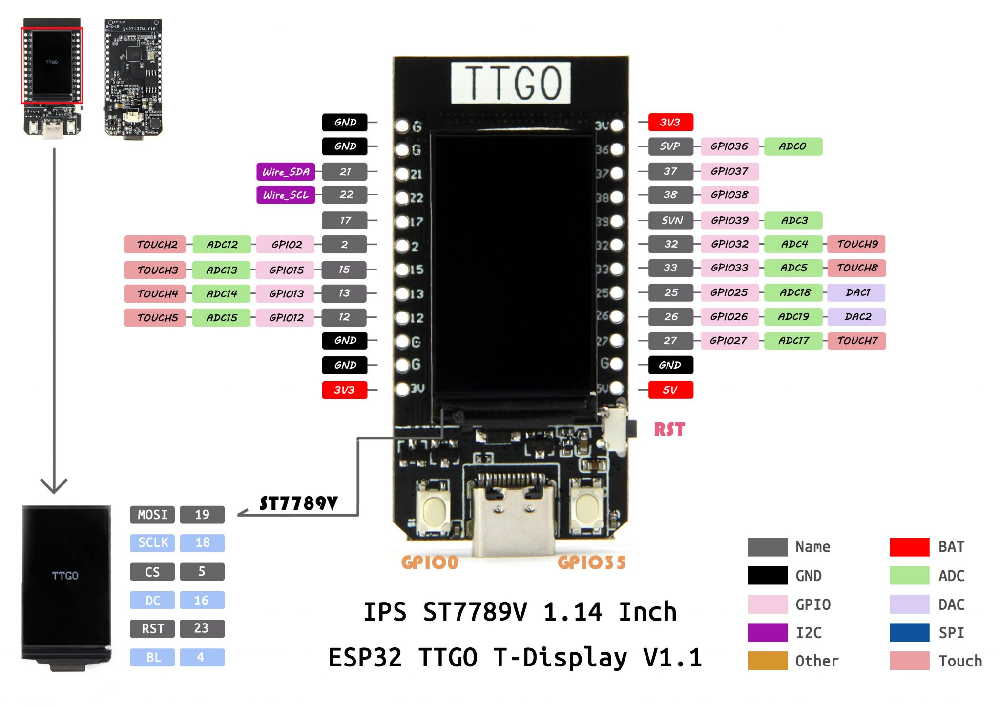
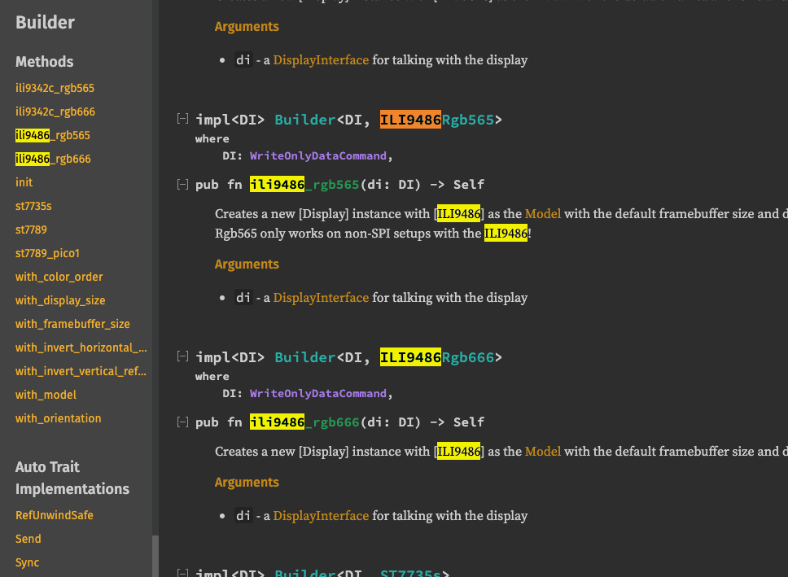
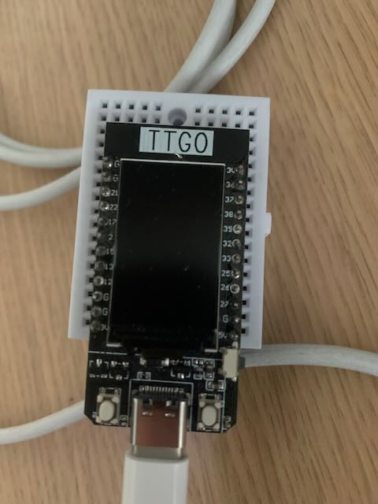
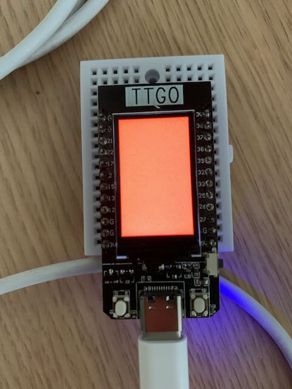
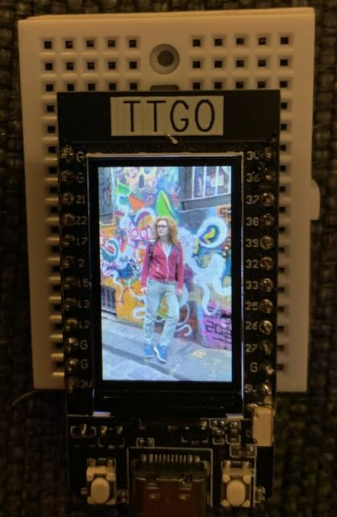

I was recently inspired to get back into doing software stuff on microcontrollers, and I thought I'd start out by looking into the state of the [embedded Rust](https://github.com/rust-embedded/wg#embedded-devices-working-group) ecosystem. I wasn't sure exactly what I wanted to accomplish, but I had a few [Lilygo T-Display](https://www.lilygo.cc/products/lilygo%C2%AE-ttgo-t-display-1-14-inch-lcd-esp32-control-board?variant=42159376433333) microcontrollers. These are cheap ($8 each at time of writing) ESP32 boards with lots of gpio and an integrated 1.14" TFT display.

This post is a mix of a tutorial for ESP32 development in Rust, as well as my feelings and stumbling blocks while figuring all of this out on my own. I am not an embedded developer by training or trade, and a lot of things that may be obvious to professional embedded developers were not obvious to me. I do not mean to indict the developers of any of these crates.



I didn't know exactly what I wanted to do, but since these boards have a cute little display on them, I figured I should probably figure out how to drive that. I had done some C++ programming for these boards a few years ago, so I knew the displays could perform quite well under ideal circumstances and I wanted to see if I could achieve similar results with Rust.

I figured the minimum interesting thing I could do would be to get the screen to turn a color of my choosing. I picked red.

<div class="callout">
	<div class="callout-inner">
        <div class="callout-header">GOAL</div>
        <p>Turn the screen red</p>
  </div>
</div>

To start out, Espressif (makers of the ESP32 series of SoC) have put quite a bit of work into building out Rust support for the platform. There is a [book](https://esp-rs.github.io/book/introduction.html) which is still a bit early in development, but did help me in a few key areas, as well as an [#esp-rs](https://app.element.io/#/room/#esp-rs:matrix.org) matrix chat room where I was sometimes able to get some help when I needed it. Let's begin by setting up our environment for ESP32 development!

# Configuring our Environment

<div class="callout">
	<div class="callout-inner">
        <div class="callout-header">NOTE</div>
<p>I did all of this environment setup and all of the development on macOS with an aarch64 processor. I cannot comment on the tools as they work in different environments, but I have to imagine that I'm using a low-priority platform for the maintainers of these tools. So if they work for me then they should probably work for someone on a more conventional platform like linux on x64.</p>
  </div>
</div>

Let's begin by configuring a Rust toolchain for ESP32 development, and run a "Hello, World" program on our board.

<div class="callout">
	<div class="callout-inner">
        <div class="callout-header">GOAL</div>
        <p>Run 'Hello, World' on ESP32 hardware</p>
  </div>
</div>

The first thing we're going to need is a Rust toolchain that can compile code for an ESP32 target. Espressif has helpfully made a tool very similar to rustup for managing precompiled binaries of their fork of rustc called [EspUp](https://github.com/esp-rs/espup#installation). We can install it, then use it to install our toolchain with a few simple commands (you must already have `rustup` installed):

```bash
$ cargo install espup
$ espup install
$ rustup toolchain list
stable-aarch64-apple-darwin (default)
esp
```

<div class="callout callout-warning">
	<div class="callout-inner">
        <div class="callout-header">WARNING</div>
<p>The output of <code>espup install</code> includes environment variables that <em>must be set</em> in order for your development environment to work. Ensure that you follow these instructions carefully or your compiler toolchain <em>will not work</em>.</p>
  </div>
</div>

Note the `esp` entry we get back from `rustup` on the last line - this is our new ESP32-compatible toolchain. At time of writing, this binary is a nightly version of rustc 1.66 from 2022-12-13.

Next we're going to need a tool to upload the binaries that rustc creates onto our microcontroller.

```bash
$ cargo install cargo-espflash
```

`cargo-espflash` is another tool created by Espressif to upload programs onto their chips and monitor the logs of those programs as they run. With that, our environment should be primed to write some Rust and send it onto a chip!

# Hello, world!

Let's make ourselves a project to write our Rust code in. We could write this from scratch, or we could use a helpful [cargo-generate](https://github.com/cargo-generate/cargo-generate#installation) template that [Espressif created for us](https://github.com/esp-rs/esp-idf-template). There are options for different ESP32 variants, and wether we want to include the Rust stdlib or opt for a `no_std` crate (both are supported but this example will use std). These are the options that I provided to `cargo-generate` when creating my package:

```
$ cargo generate https://github.com/esp-rs/esp-idf-template cargo
🤷   Project Name: esp32-image-display
✔ 🤷   ESP-IDF native build version (v4.3.2 = previous stable, v4.4 = stable, mainline = UNSTABLE) · v4.4
✔ 🤷   STD support · true
✔ 🤷   MCU · esp32
✔ 🤷   Configure project to use Dev Containers? · false
```

There are a lot of files created in this crate, but let's start by opening `src/main.rs`.

```rust
use esp_idf_sys as _; // If using the `binstart` feature of `esp-idf-sys`, always keep this module imported

fn main() {
    // It is necessary to call this function once. Otherwise some patches to the runtime
    // implemented by esp-idf-sys might not link properly. See https://github.com/esp-rs/esp-idf-template/issues/71
    esp_idf_sys::link_patches();

    println!("Hello, world!");
}
```

Much like the template we get from `cargo new`, this file contains the "hello world" program. We should be able to test it out with the expected `cargo run` thanks to this template setting `target.xtensa-esp32-espidf.runner` to `espflash --monitor` in the `.cargo/config.toml` file. Because of this, `cargo run` gives us the normal Rust compilation output, followed by the result of feeding our binary to `cargo espflash`.

On my machine I am first prompted to chose which of two interfaces should be used for flashing the program to my chip, these both point to the same chip and in my experience do not differ from each other.

<div class="callout">
	<div class="callout-inner">
        <div class="callout-header">NOTE</div>
        <p>You do not <em>need</em> a Lilygo T-Display to follow along with these instructions, your Rust code should compile just fine if you don't have a board to flash, but these instructions assume you have a hardware board connected to your computer that can be flashed.</p>
  </div>
</div>

```bash
$ cargo run
<normal Rust compilation output>
Detected 2 serial ports. Ports which match a known common dev board are highlighted.

❯ /dev/cu.usbserial-02123A69 - CP2104 USB to UART Bridge Controller
  /dev/tty.usbserial-02123A69 - CP2104 USB to UART Bridge Controller

Serial port: /dev/cu.usbserial-02123A69
Connecting...

Chip type:         ESP32 (revision 1)
Crystal frequency: 40MHz
Flash size:        4MB
Features:          WiFi, BT, Dual Core, 240MHz, Coding Scheme None
MAC address:       4c:11:ae:a6:aa:64
App/part. size:    447440/4128768 bytes, 10.84%
[00:00:01] ########################################      16/16      segment 0x1000
[00:00:00] ########################################       1/1       segment 0x8000
[00:00:23] ########################################     227/227     segment 0x10000
Flashing has completed!
Commands:
    CTRL+R    Reset chip
    CTRL+C    Exit

ets Jun  8 2016 00:22:57
I (0) cpu_start: App cpu up.
I (237) cpu_start: Pro cpu start user code
I (237) cpu_start: cpu freq: 160000000
I (237) cpu_start: Application information:
I (242) cpu_start: Project name:     libespidf
I (247) cpu_start: App version:      1
I (251) cpu_start: Compile time:     Dec 27 2022 16:20:16
I (257) cpu_start: ELF file SHA256:  0000000000000000...
I (263) cpu_start: ESP-IDF:          9ee3c83-dirty
I (269) heap_init: Initializing. RAM available for dynamic allocation:
I (276) heap_init: At 3FFAE6E0 len 00001920 (6 KiB): DRAM
I (282) heap_init: At 3FFB2C08 len 0002D3F8 (180 KiB): DRAM
I (288) heap_init: At 3FFE0440 len 00003AE0 (14 KiB): D/IRAM
I (295) heap_init: At 3FFE4350 len 0001BCB0 (111 KiB): D/IRAM
I (301) heap_init: At 4008AECC len 00015134 (84 KiB): IRAM
I (309) spi_flash: detected chip: generic
I (312) spi_flash: flash io: dio
I (317) cpu_start: Starting scheduler on PRO CPU.
I (0) cpu_start: Starting scheduler on APP CPU.
Hello, world!
```

<div class="callout callout-success">
	<div class="callout-inner">
        <div class="callout-header">GOAL ACHIEVED!</div>
        <p>There it is! We got a "Hello, world!" back from our board with just the preconfigured project!</p>
  </div>
</div>

Now let's see if we can get it to do something interesting.

# Turn the display red

Remember we want to take the display on the board and turn it solid red. It turns out that there's a great number of crates in the embedded ecosystem for doing graphics programming. We're going to use several of them in this article. I pretty quickly stumbled upon [`embedded-graphics`](https://docs.rs/embedded-graphics), which appeared to be exactly what I was looking for. This is a 2D graphics library that contains graphics primitives, but no hardware-specific device drivers. It must be paired with a [driver crate](https://docs.rs/embedded-graphics/0.7.1/embedded_graphics/#display-drivers) for the specific type of display that you'd like to run.

In our case, the display unit on the Lilygo T-Display is an ST7789V, which is a protocol-compatible (afaict) variant of the ST7789 display. The `embedded-graphics` readme points us to the [`st7789`](https://crates.io/crates/st7789) crate as a compatible driver. The readme for `st7789` contains a [deprecation warning](https://github.com/almindor/st7789#deprecation-warning) pointing us instead to the [`mipidsi`](https://docs.rs/mipidsi/0.6/mipidsi/) crate. This readme looks much more promising, and it provides us with the following code snippet to start from:

```rust
// create a DisplayInterface from SPI and DC pin, with no manual CS control
let di = SPIInterfaceNoCS::new(spi, dc);
// create the ILI9486 display driver from the display interface and optional RST pin
let mut display = Builder::ili9486(di)
    .init(&mut delay, Some(rst));
// clear the display to black
display.clear(Rgb666::BLACK)?;
```

This appears to do _nearly_ what we want, but it sets the screen to black instead of red. Let's go ahead and change that, and then we can start to work backwards into getting this code to compile.

```rust
display.clear(Rgb666::RED)?;
```

Let's dump this code block into our `main` function and configure it for error-handling, since the snippet provided expects to be able to use `?`.

```rust
use std::error::Error;

use esp_idf_sys as _;

fn main() -> Result<(), Box<dyn Error>> {
    esp_idf_sys::link_patches();

    let di = SPIInterfaceNoCS::new(spi, dc);
    let mut display = Builder::ili9486(di).init(&mut delay, Some(rst));
    display.clear(Rgb666::RED)?;

    Ok(())
}
```

Now let's try to compile it:

```
$ cargo run
error[E0433]: failed to resolve: use of undeclared type `SPIInterfaceNoCS`
  --> src/main.rs:11:14
   |
11 |     let di = SPIInterfaceNoCS::new(spi, dc);
   |              ^^^^^^^^^^^^^^^^ use of undeclared type `SPIInterfaceNoCS`

error[E0433]: failed to resolve: use of undeclared type `Rgb666`
  --> src/main.rs:15:19
   |
15 |     display.clear(Rgb666::RED)?;
   |                   ^^^^^^ use of undeclared type `Rgb666`

error[E0425]: cannot find value `spi` in this scope
  --> src/main.rs:11:36
   |
11 |     let di = SPIInterfaceNoCS::new(spi, dc);
   |                                    ^^^ not found in this scope

error[E0425]: cannot find value `dc` in this scope
  --> src/main.rs:11:41
   |
11 |     let di = SPIInterfaceNoCS::new(spi, dc);
   |                                         ^^ not found in this scope

error[E0433]: failed to resolve: use of undeclared type `Builder`
  --> src/main.rs:13:23
   |
13 |     let mut display = Builder::ili9486(di).init(&mut delay, Some(rst));
   |                       ^^^^^^^ not found in this scope
   |
help: consider importing this struct
   |
1  | use std::thread::Builder;
error[E0425]: cannot find value `delay` in this scope
  --> src/main.rs:13:54
   |
13 |     let mut display = Builder::ili9486(di).init(&mut delay, Some(rst));
   |                                                      ^^^^^ not found in this scope

error[E0425]: cannot find value `rst` in this scope
  --> src/main.rs:13:66
   |
13 |     let mut display = Builder::ili9486(di).init(&mut delay, Some(rst));
   |                                                                  ^^^ not found in this scope
```

Of course the snippet references many variables which I never defined in it - let's stub those out with `todo!` and see if we can get rid of some of this noise.

```rust
let spi = todo!();
let dc = todo!();
let delay = todo!();
let rst = todo!();

let di = SPIInterfaceNoCS::new(spi, dc);
let mut display = Builder::ili9486(di).init(&mut delay, Some(rst));
display.clear(Rgb666::RED)?;
```

Compiling now gives us a bunch of missing _type_ errors instead of variable errors, let's see if we can figure those out as well.

```
$ cargo run
error[E0433]: failed to resolve: use of undeclared type `SPIInterfaceNoCS`
  --> src/main.rs:17:14
   |
17 |     let di = SPIInterfaceNoCS::new(spi, dc);
error[E0433]: failed to resolve: use of undeclared type `Rgb666`
  --> src/main.rs:21:19
   |
21 |     display.clear(Rgb666::RED)?;
   |                   ^^^^^^ use of undeclared type `Rgb666`

error[E0433]: failed to resolve: use of undeclared type `Builder`
  --> src/main.rs:19:23
   |
19 |     let mut display = Builder::ili9486(di).init(&mut delay, Some(rst));
   |                       ^^^^^^^ not found in this scope
   |
help: consider importing this struct
   |
1  | use std::thread::Builder;
   |
```

`Builder` is easy enough, this is a struct coming from the `mipidsi` crate itself ([`mipidsi::Builder`](https://docs.rs/mipidsi/0.6/mipidsi/builder/struct.Builder.html)). The other types are not going to be quite so easy to find. Let's start with `SPIInterfaceNoCS`. Since this is passed into `Builder::ili9486`, we can look at the signature of that function.



Well it appears that the `ili9486` function referenced in the docs no longer exists itself. There are two variants - one for `Rgb565` colorspace and one for `Rgb666` colorspace. It seems that these builder creation functions are setting us up to drive a particular type of display, as defined by a corresponding [`mipidsi::Model`](https://docs.rs/mipidsi/0.6/mipidsi/models/trait.Model.html) implementation. As referenced before, the display on our board is a ST7789. Let's swap this builder creation function for `Builder::st7789_pico1`. The `_pico1` subtype is for the 135x240 variant of the display that exists on this model (it took me a bit to figure this out). The docs indicate that we need to provide it with a `DisplayInterface`, which links us to the trait [`display_interface::WriteOnlyDataCommand`](https://docs.rs/display-interface/0.4.1/display_interface/trait.WriteOnlyDataCommand.html). The `display-interface` crate is described by the docs as "A generic display interface." The docs.rs page for `display-interface` doesn't give us any hints as to where `SPIInterfaceNoCS` might be coming from.

I believe at this point I went to `display-interface`'s [reverse dependencies page](https://crates.io/crates/display-interface/reverse_dependencies) on crates.io to see if I could get any clues. The top two links on that page were `display-interface-spi` and `display-interface-i2c`. I figured these crates likely contained the implementations for controlling displays across various types of communication busses. The type we're looking for uses an SPI interface, so it is found within `display-interface-spi` at [`display_interface_spi::SPIInterfaceNoCS`](https://docs.rs/display-interface-spi/0.4.1/display_interface_spi/struct.SPIInterfaceNoCS.html).

Next in our error output we have the `Rgb666` type. I wasn't sure where this was coming from, so I filled in the gaps I did know and tried to see if the compiler could help me out at all.

```rust
use display_interface_spi::SPIInterfaceNoCS;
use mipidsi::Builder;
use std::error::Error;

use esp_idf_sys as _;

fn main() -> Result<(), Box<dyn Error>> {
    esp_idf_sys::link_patches();

    let spi = todo!();
    let dc = todo!();
    let delay = todo!();
    let rst = todo!();

    let di = SPIInterfaceNoCS::new(spi, dc);
    let mut display = Builder::st7789_pico1(di).init(&mut delay, Some(rst));
    display.clear(Rgb666::RED)?;

    Ok(())
}
```

Let's see if the compiler is any happier now

```
$ cargo run
error[E0433]: failed to resolve: use of undeclared type `Rgb666`
  --> src/main.rs:20:19
   |
20 |     display.clear(Rgb666::RED)?;
   |                   ^^^^^^ use of undeclared type `Rgb666`

error[E0599]: no method named `clear` found for enum `Result` in the current scope
  --> src/main.rs:20:13
   |
20 |     display.clear(Rgb666::RED)?;
   |             ^^^^^ method not found in `Result<mipidsi::Display<SPIInterfaceNoCS<_, _>, ST7789, _>, InitError<_>>`
```

It is not. And unfortunately it doesn't give us any hints as to where the `Rgb666` color might be coming from. The second compiler error here does give us some amount of hinting as to what we might want to fix. It seems [`Builder::init`](https://docs.rs/mipidsi/0.6/mipidsi/builder/struct.Builder.html#method.init) returns a `Result` and not the fully initialized `mipidsi::Display`. Let's fix that by adding a `?` after `init`.

```rust
let mut display = Builder::st7789_pico1(di).init(&mut delay, Some(rst))?;
```

What happens when we try to build now?

```
error[E0433]: failed to resolve: use of undeclared type `Rgb666`
  --> src/main.rs:20:19
   |
20 |     display.clear(Rgb666::RED)?;
   |                   ^^^^^^ use of undeclared type `Rgb666`

error[E0277]: the trait bound `InitError<_>: std::error::Error` is not satisfied
  --> src/main.rs:19:70
   |
19 |     let mut display = Builder::st7789_pico1(di).init(&mut delay, Some(rst))?;
   |                                                                      ^ the trait `std::error::Error` is not implemented for `InitError<_>`
   |
   = help: the following other types implement trait `FromResidual<R>`:
             <Result<T, F> as FromResidual<Result<Infallible, E>>>
             <Result<T, F> as FromResidual<Yeet<E>>>
   = note: required for `Box<dyn std::error::Error>` to implement `From<InitError<_>>`
   = note: required for `Result<(), Box<dyn std::error::Error>>` to implement `FromResidual<Result<Infallible, InitError<_>>>`

error[E0599]: no method named `clear` found for struct `mipidsi::Display` in the current scope
   --> src/main.rs:20:13
    |
20  |     display.clear(Rgb666::RED)?;
    |             ^^^^^ method not found in `mipidsi::Display<SPIInterfaceNoCS<_, _>, ST7789, _>`
    |
   ::: /Users/lily/.cargo/registry/src/github.com-1ecc6299db9ec823/embedded-graphics-core-0.3.3/src/draw_target/mod.rs:422:8
    |
422 |     fn clear(&mut self, color: Self::Color) -> Result<(), Self::Error> {
    |        ----- the method is available for `mipidsi::Display<SPIInterfaceNoCS<_, _>, ST7789, _>` here
    |
    = help: items from traits can only be used if the trait is in scope
help: the following trait is implemented but not in scope; perhaps add a `use` for it:
    |
1   | use embedded_graphics_core::draw_target::DrawTarget;
    |
```

Two new errors! This may seem like an unfortunate outcome but one of them is exactly what I was hoping for. Let's look at the first new error

```
error[E0277]: the trait bound `InitError<_>: std::error::Error` is not satisfied
  --> src/main.rs:19:70
   |
19 |     let mut display = Builder::st7789_pico1(di).init(&mut delay, Some(rst))?;
   |                                                                      ^ the trait `std::error::Error` is not implemented for `InitError<_>`
```

Unfortunately, [`mipidsi::error::InitError`](https://docs.rs/mipidsi/0.6/mipidsi/error/enum.InitError.html) does not implement `std::error::Error`, so we're not able to use `?` with it in our `main` fn, which (as written) requires this implementation. We can provide a (somewhat inadequate) little bridge to get us there.

```rust
let mut display = Builder::st7789_pico1(di)
	.init(&mut delay, Some(rst))
	.map_err(|_| Box::<dyn Error>::from("display init"))?;
```

This omission is probably a consequence of `Error` only recently being moved to `core`, and most of these crates being designed to work in `no_std`.

Now that this one is resolved, let's look at that other error message.

```
error[E0599]: no method named `clear` found for struct `mipidsi::Display` in the current scope
   --> src/main.rs:20:13
    |
20  |     display.clear(Rgb666::RED)?;
    |             ^^^^^ method not found in `mipidsi::Display<SPIInterfaceNoCS<_, _>, ST7789, _>`
    |
   ::: /Users/lily/.cargo/registry/src/github.com-1ecc6299db9ec823/embedded-graphics-core-0.3.3/src/draw_target/mod.rs:422:8
    |
422 |     fn clear(&mut self, color: Self::Color) -> Result<(), Self::Error> {
    |        ----- the method is available for `mipidsi::Display<SPIInterfaceNoCS<_, _>, ST7789, _>` here
    |
    = help: items from traits can only be used if the trait is in scope
help: the following trait is implemented but not in scope; perhaps add a `use` for it:
    |
1   | use embedded_graphics_core::draw_target::DrawTarget;
    |
```

This is what I was hoping to wrestle out of the compiler - some direction as to where our `Rgb666` type is coming from. It seems that the `clear` method is not inherent to the `mipidsi::Display` type, but actually comes from a trait in a different crate - [`embedded_graphics::draw_target::DrawTarget`](https://docs.rs/embedded-graphics/0.7.1/embedded_graphics/draw_target/trait.DrawTarget.html). Let's import that trait so that the compiler can resolve the method.

```rust
use embedded_graphics::draw_target::DrawTarget;
...

    display
        .clear(Rgb666::RED)
        .map_err(|_| Box::<dyn Error>::from("clear display"))?;
```

We're still getting our `undeclared type 'Rgb666'` error, but now that the compiler knows what method this is, we can cheat a little bit to figure out what type should be supplied to it.

```rust
display
	.clear(())
	.map_err(|_| Box::<dyn Error>::from("clear display"))?;
```

Compiling this forces the compiler to tell us what type it expects to be passed into the `clear` function.

```
$ cargo run
error[E0308]: mismatched types
   --> src/main.rs:22:16
    |
22  |         .clear(())
    |          ----- ^^ expected struct `Rgb565`, found `()`
    |          |
    |          arguments to this function are incorrect
    |
note: associated function defined here
   --> /Users/lily/.cargo/registry/src/github.com-1ecc6299db9ec823/embedded-graphics-core-0.3.3/src/draw_target/mod.rs:422:8
    |
422 |     fn clear(&mut self, color: Self::Color) -> Result<(), Self::Error> {
    |        ^^^^^
```

Unfortunately rustc doesn't give us a fully qualified path here, but it does stick out to me that the name of the type changed from `Rgb666` to `Rgb565`. It seems that the display driver included in the `mipidsi` documentation is not the same after we switched from the `ili9486` driver to the `st7789` driver. Since the `clear` method was coming from `embedded-graphics`, I searched the crate documentation there and found that this type is coming from that crate - [`embedded_graphics::pixelcolor::Rgb565`](https://docs.rs/embedded-graphics/0.7.1/embedded_graphics/pixelcolor/struct.Rgb565.html). Let's import this and pass a red color into `clear`. We also need to import the `prelude` module from `embedded-graphics`.

```rust
use embedded_graphics::{draw_target::DrawTarget, pixelcolor::Rgb565, prelude::*};
...

    display
        .clear(Rgb565::RED)
        .map_err(|_| Box::<dyn Error>::from("clear display"))?;
```

Now that we have all of that sorted, let's try to run it!

```
$ cargo run
error[E0277]: the trait bound `(): embedded_hal::blocking::delay::DelayUs<u32>` is not satisfied
   --> src/main.rs:19:15
    |
19  |         .init(&mut delay, Some(rst))
    |          ---- ^^^^^^^^^^ the trait `embedded_hal::blocking::delay::DelayUs<u32>` is not implemented for `()`
    |          |
    |          required by a bound introduced by this call
    |
note: required by a bound in `mipidsi::Builder::<DI, MODEL>::init`
   --> /Users/lily/.cargo/registry/src/github.com-1ecc6299db9ec823/mipidsi-0.5.0/src/builder.rs:104:33
    |
104 |         delay_source: &mut impl DelayUs<u32>,
    |                                 ^^^^^^^^^^^^ required by this bound in `mipidsi::Builder::<DI, MODEL>::init`

error[E0277]: the trait bound `(): embedded_hal::blocking::spi::write::Default<u8>` is not satisfied
  --> src/main.rs:18:39
   |
18 |     let mut display = Builder::st7789_pico1(di)
   |                       --------------------- ^^ the trait `embedded_hal::blocking::spi::write::Default<u8>` is not implemented for `()`
   |                       |
   |                       required by a bound introduced by this call
   |
   = help: the trait `display_interface::WriteOnlyDataCommand` is implemented for `SPIInterfaceNoCS<SPI, DC>`
   = note: required for `()` to implement `embedded_hal::blocking::spi::Write<u8>`
   = note: required for `SPIInterfaceNoCS<(), ()>` to implement `display_interface::WriteOnlyDataCommand`
note: required by a bound in `models::st7789::variants::<impl mipidsi::Builder<DI, ST7789>>::st7789`
  --> /Users/lily/.cargo/registry/src/github.com-1ecc6299db9ec823/mipidsi-0.5.0/src/models/st7789/variants.rs:9:9
   |
9  |     DI: WriteOnlyDataCommand,
   |         ^^^^^^^^^^^^^^^^^^^^ required by this bound in `models::st7789::variants::<impl mipidsi::Builder<DI, ST7789>>::st7789`

error[E0277]: the trait bound `(): embedded_hal::digital::v1::OutputPin` is not satisfied
  --> src/main.rs:18:39
   |                       --------------- ^^ the trait `embedded_hal::digital::v1::OutputPin` is not implemented for `()`
   |                       |
   |                       required by a bound introduced by this call
   |
   = help: the trait `embedded_hal::digital::v1::OutputPin` is implemented for `embedded_hal::digital::v1_compat::OldOutputPin<T>`
   = note: required for `()` to implement `embedded_hal::digital::v2::OutputPin`
   = note: required for `SPIInterfaceNoCS<(), ()>` to implement `display_interface::WriteOnlyDataCommand`
note: required by a bound in `models::st7789::variants::<impl mipidsi::Builder<DI, ST7789>>::st7789`
  --> /Users/lily/.cargo/registry/src/github.com-1ecc6299db9ec823/mipidsi-0.5.0/src/models/st7789/variants.rs:9:9
   |
9  |     DI: WriteOnlyDataCommand,
   |         ^^^^^^^^^^^^^^^^^^^^ required by this bound in `models::st7789::variants::<impl mipidsi::Builder<DI, ST7789>>::st7789`

error[E0277]: the trait bound `(): embedded_hal::blocking::spi::write::Default<u8>` is not satisfied
   --> src/main.rs:17:36
    |
17  |     let di = SPIInterfaceNoCS::new(spi, dc);
    |              --------------------- ^^^ the trait `embedded_hal::blocking::spi::write::Default<u8>` is not implemented for `()`
    |              |
    |              required by a bound introduced by this call
    |
    = note: required for `()` to implement `embedded_hal::blocking::spi::Write<u8>`
note: required by a bound in `SPIInterfaceNoCS::<SPI, DC>::new`
   --> /Users/lily/.cargo/registry/src/github.com-1ecc6299db9ec823/display-interface-spi-0.4.1/src/lib.rs:185:10
    |
185 |     SPI: hal::blocking::spi::Write<u8>,
    |          ^^^^^^^^^^^^^^^^^^^^^^^^^^^^^ required by this bound in `SPIInterfaceNoCS::<SPI, DC>::new`

error[E0277]: the trait bound `(): embedded_hal::digital::v1::OutputPin` is not satisfied
   --> src/main.rs:17:41
    |
17  |     let di = SPIInterfaceNoCS::new(spi, dc);
    |              ---------------------      ^^ the trait `embedded_hal::digital::v1::OutputPin` is not implemented for `()`
    |              |
    |              required by a bound introduced by this call
    |
    = help: the trait `embedded_hal::digital::v1::OutputPin` is implemented for `embedded_hal::digital::v1_compat::OldOutputPin<T>`
    = note: required for `()` to implement `embedded_hal::digital::v2::OutputPin`
note: required by a bound in `SPIInterfaceNoCS::<SPI, DC>::new`
   --> /Users/lily/.cargo/registry/src/github.com-1ecc6299db9ec823/display-interface-spi-0.4.1/src/lib.rs:186:9
    |
186 |     DC: OutputPin,
    |         ^^^^^^^^^ required by this bound in `SPIInterfaceNoCS::<SPI, DC>::new`

For more information about this error, try `rustc --explain E0277`.
warning: `esp32-image-display` (bin "esp32-image-display") generated 1 warning
error: could not compile `esp32-image-display` due to 5 previous errors; 1 warning emitted
```

> me writing todo!: haha i'm so smart i can get away with anything
>
> me dealing with todo!: oh god what the hell is this? who did this to me?

We are unfortunately now seeing the consequences of our earlier simplifications. The rest of the code is working and the `todo!` macro calls are no longer sufficient to satisfy the compiler. We need to pass in some proper values here.

Let's start with the easiest one. It's simple enough to find a value to pass in as `delay` to [`Builder::init`](https://docs.rs/mipidsi/0.6/mipidsi/builder/struct.Builder.html#method.init). This has to be a type which implements [`embedded_hal::blocking::delay::DelayUs`](https://docs.rs/embedded-hal/0.2.7/embedded_hal/blocking/delay/trait.DelayUs.html). `embedded-hal` is a _hardware abstraction layer_ crate designed to allow crate authors to work with types that are not specific to any one type of hardware. Much like `embedded-graphics` and `display-interface`, we need to plug in a driver crate for our specific hardware. This is `esp-idf-hal`, which was created by Espressif for this purpose.

<div class="callout callout-warning">
	<div class="callout-inner">
        <div class="callout-header">WARNING</div>
<p>The latest version of <code>esp-idf-hal</code> is <code>0.40.1</code>, but this is currently incompatible with the rest of the ecosystem as it depends on a beta version of <code>embedded-hal</code> that the rest of the ecosystem does not use yet. Use <code>0.39.4</code> instead.</p>
  </div>
</div>

<div class="callout callout-warning">
	<div class="callout-inner">
        <div class="callout-header">WARNING</div>
<p><code>esp-idf-hal</code> does not have live documentation on docs.rs. They require their docs to be built with an espressif-compatible toolchain, which docs.rs is not liable to start including any time soon. You can get do their documentation by following the "documentation" link on crates.io (or even on docs.rs) but the standard docs.rs flow will not work for this crate.</p>
  </div>
</div>

If we look in the `esp-idf-hal` documentation, there is a `delay` module, and a few types in there that implement the trait we need. There's an [`Ets`](https://esp-rs.github.io/esp-idf-hal/esp_idf_hal/delay/struct.Ets.html) type, which seems to support short delays, and a [`FreeRtos`](https://esp-rs.github.io/esp-idf-hal/esp_idf_hal/delay/struct.FreeRtos.html) type, which supports longer delays. I'm not sure which of these is right for my case, so we're going to pick the first one.

```rust
use esp_idf_hal::delay::Ets;

...

    let mut delay = Ets;
```

Note that we also need to make the `delay` variable mutable here, since we pass `&mut delay` into [`Builder::init`](https://docs.rs/mipidsi/0.6/mipidsi/builder/struct.Builder.html#method.init).

The next easiest for us to fill in is a single pin - the `dc` pin. What DC stands for I have no idea, but hey we have that same symbol on the pinout diagram so let's connect it up and see what happens.

```rust
use esp_idf_hal::{
    delay::Ets,
    gpio::{Gpio16, PinDriver},
};
...

    let dc = PinDriver::input_output_od(unsafe { Gpio16::new() })?;
```

This took me a bit of floundering to figure out, but I eventually got that I'd have to create a [`PinDriver`](https://esp-rs.github.io/esp-idf-hal/esp_idf_hal/gpio/struct.PinDriver.html), which is responsible for reading and writing data from a gpio pin. We pass it `Gpio16`, which we determine by looking at the pinout diagram for the T-Display and seeing that the DC signal of the display is on pin 16. The `unsafe` code block is required for initializing the pin because the library needs external guarantees that the compiler cannot provide - namely that no other place in the code will ever call `Gpio16::new()` after we've called it here.

Similarly we can fill in the `rst` signal with a `PinDriver` for pin 23.

```rust
use esp_idf_hal::{
    delay::Ets,
    gpio::{Gpio16, Gpio23, PinDriver},
};
...

    let rst = PinDriver::input_output_od(unsafe { Gpio23::new() })?;
```

There's just one `todo!` left that we have to fill in, but this one is a bit more complicated. [`SPIInterfaceNoCS::new`](https://docs.rs/display-interface-spi/0.4.1/display_interface_spi/struct.SPIInterfaceNoCS.html#method.new) needs a parameter called `spi` which implements [`embedded_hal::blocking::spi::Write`](https://docs.rs/embedded-hal/0.2.5/embedded_hal/blocking/spi/trait.Write.html). [SPI](https://en.wikipedia.org/wiki/Serial_Peripheral_Interface) is a serial communications interface that our chip uses to communicate with the display. We're going to pull in a few more types from `esp-idf-hal` to build up an SPI communications channel.

First we need to create an [`SpiDriver`](https://esp-rs.github.io/esp-idf-hal/esp_idf_hal/spi/struct.SpiDriver.html), which has a constructor with several parameters.

```rust
fn new<SPI: SpiAnyPins>(
	_spi: impl Peripheral<P = SPI> + 'd,
	sclk: impl Peripheral<P = impl OutputPin> + 'd,
	sdo: impl Peripheral<P = impl OutputPin> + 'd,
	sdi: Option<impl Peripheral<P = impl InputPin + OutputPin> + 'd>,
	dma: Dma,
) -> Result<Self, EspError>
```

We need a reference to the [`SPI2`](https://esp-rs.github.io/esp-idf-hal/esp_idf_hal/spi/struct.SPI2.html) peripheral on the board (for this I basically had to guess), as well as the SCLK and SDO pins. The SCLK pin was easy enough to figure out, the pinout diagram clearly calls this out as pin 18. When I saw SDO though, I was a little lost. There was no SDO pin on my pinout diagram.

It turns out that this is a consequence of a recent change to naming conventions of SPI signal names. The MOSI signal was renamed to SDO ([reference](https://www.oshwa.org/a-resolution-to-redefine-spi-signal-names/)) to eliminate harmful historic terminology from the ecosystem. I agree with this change, I think it's a good thing, but it did take me a bit of digging to figure this out. I assume that if I had a newer microcontroller board, it would use the new signal names and I wouldn't have had any issues. Armed with this knowledge, we can connect pin 19 to the SDO signal in the constructor.

Next there's an optional SDI signal, which seems to not be present for this display so we'll set it to `None`.

Finally we need a [`Dma`](https://esp-rs.github.io/esp-idf-hal/esp_idf_hal/spi/enum.Dma.html) , which is an enum that allows us to specify the method of direct-memory-access used by the SPI driver. We'll want to set this to `Channel1` and pass in a channel size of `240 * 135 * 2 + 8`. This is the display's height (240), width (135), multiplied by a factor of two and 8 more bytes at the end. This channel size was lifted directly from the `max_transfer_sz` property of the `spi_bus_config_t` in the [C++ drivers for this display](https://github.com/Xinyuan-LilyGO/TTGO-T-Display/blob/7ad1b2807a37b5a6ba33a4fb0efbe8466e96faa3/TFT_eSPI/Processors/TFT_eSPI_ESP32.c#L671) . Again it took me some trial and error to figure this out.

Let's see what it looks like when we put all of this together into [`SpiDriver::new`](https://esp-rs.github.io/esp-idf-hal/esp_idf_hal/spi/struct.SpiDriver.html#method.new)

```rust
use esp_idf_hal::{
    delay::Ets,
    gpio::{Gpio16, Gpio18, Gpio19, Gpio23, PinDriver},
    spi::{Dma, SpiDriver, SPI2},
};

	let spi = unsafe { SPI2::new() };
    let sclk = unsafe { Gpio18::new() };
    let sdo = unsafe { Gpio19::new() };

    let spi = SpiDriver::new(
        spi,
        sclk,
        sdo,
        None,
        Dma::Channel1(240 * 135 * 2 + 8),
    )?;

    let di = SPIInterfaceNoCS::new(spi, dc);
```

Let's see if we can get this to compile

```
$ cargo run
error[E0277]: the trait bound `SpiDriver<'_>: embedded_hal::blocking::spi::write::Default<u8>` is not satisfied
   --> src/main.rs:27:36
    |
27  |     let di = SPIInterfaceNoCS::new(spi, dc);
    |              --------------------- ^^^ the trait `embedded_hal::blocking::spi::write::Default<u8>` is not implemented for `SpiDriver<'_>`
    |              |
    |              required by a bound introduced by this call
    |
    = help: the trait `embedded_hal::blocking::spi::Write<u8>` is implemented for `SpiDeviceDriver<'d, T>`
    = note: required for `SpiDriver<'_>` to implement `embedded_hal::blocking::spi::Write<u8>`
note: required by a bound in `SPIInterfaceNoCS::<SPI, DC>::new`
   --> /Users/lily/.cargo/registry/src/github.com-1ecc6299db9ec823/display-interface-spi-0.4.1/src/lib.rs:185:10
    |
185 |     SPI: hal::blocking::spi::Write<u8>,
    |          ^^^^^^^^^^^^^^^^^^^^^^^^^^^^^ required by this bound in `SPIInterfaceNoCS::<SPI, DC>::new`

...<lots of similar errors>
```

It seems that [`SpiDriver`](https://esp-rs.github.io/esp-idf-hal/esp_idf_hal/spi/struct.SpiDriver.html) doesn't implement the [`Write`](https://docs.rs/embedded-hal/0.2.5/embedded_hal/blocking/spi/trait.Write.html) trait that we need it to. Looking around at the types in the [`esp_idf_hal::spi`](https://esp-rs.github.io/esp-idf-hal/esp_idf_hal/spi/index.html) module, I encountered [`SpiDeviceDriver`](https://esp-rs.github.io/esp-idf-hal/esp_idf_hal/spi/struct.SpiDeviceDriver.html), which does have the required trait implementation. Neither [`SpiDriver`](https://esp-rs.github.io/esp-idf-hal/esp_idf_hal/spi/struct.SpiDriver.html) nor [`SpiDeviceDriver`](https://esp-rs.github.io/esp-idf-hal/esp_idf_hal/spi/struct.SpiDeviceDriver.html) has any documentation comments on them, so I'm not sure what the significance is to having two separate types that sound (to me as a newbie to the ecosystem) very similar.

Let's find the parameters to fill in [`SpiDeviceDriver::new`](https://esp-rs.github.io/esp-idf-hal/esp_idf_hal/spi/struct.SpiDeviceDriver.html#method.new)

```rust
fn new(
	driver: T,
	cs: Option<impl Peripheral<P = impl OutputPin> + 'd>,
	config: &config::Config,
) -> Result<Self, EspError>
```

The first is just the `SpiDriver` that we already created, so that's easy enough.

Next is the CS signal, which is noted on the pinout as pin 5.

Finally we have an spi [`Config`](https://esp-rs.github.io/esp-idf-hal/esp_idf_hal/spi/config/struct.Config.html) struct, we can initialize that with the defaults using [`Config::new`](https://esp-rs.github.io/esp-idf-hal/esp_idf_hal/spi/config/struct.Config.html#method.new).

Let's put these together and see if we're any closer!

```rust
use esp_idf_hal::{
    delay::Ets,
    gpio::{Gpio16, Gpio18, Gpio19, Gpio23, Gpio5, PinDriver},
    spi::{config::Config, Dma, SpiDeviceDriver, SpiDriver, SPI2},
};

    let cs = unsafe { Gpio5::new() };
    let spi = SpiDeviceDriver::new(spi, Some(cs), &Config::new())?;

    let di = SPIInterfaceNoCS::new(spi, dc);
```

Let's see if we can get it to compile now

```
$ cargo run
error[E0283]: type annotations needed
   --> src/main.rs:24:15
    |
24  |     let spi = SpiDriver::new(spi, sclk, sdo, None, Dma::Channel1(240 * 135 * 2 + 8))?;
    |               ^^^^^^^^^^^^^^ cannot infer type for type parameter `impl InputPin + OutputPin` declared on the associated function `new`
    |
    = note: cannot satisfy `_: InputPin`
note: required by a bound in `SpiDriver::<'d>::new`
   --> /Users/lily/.cargo/registry/src/github.com-1ecc6299db9ec823/esp-idf-hal-0.39.4/src/spi.rs:375:46
    |
375 |         sdi: Option<impl Peripheral<P = impl InputPin + OutputPin> + 'd>,
    |                                              ^^^^^^^^ required by this bound in `SpiDriver::<'d>::new`
```

We're so close!

Several people seem to run into this same stumbling block, as I've seen many posts on the #esp-rs matrix channel, as well as a few github issues about it. It seems that `Option<impl ...>` is generally not smart enough to work when given `None`. The Rust compiler wants a concrete type to fill the void there. We can do the required type hinting by instead passing `None::<AnyIOPin>`. [`AnyIOPin`](https://esp-rs.github.io/esp-idf-hal/esp_idf_hal/gpio/struct.AnyIOPin.html) is a generic wrapper struct that allows you to connect with any GPIO pin on the device. We're not going to do that connection of course, since this option is initialized as `None`, but it's helpful for filling in the type.

Ok. Now let's take everything we've done and put it all together!

```rust
use display_interface_spi::SPIInterfaceNoCS;
use embedded_graphics::{draw_target::DrawTarget, pixelcolor::Rgb565, prelude::*};
use esp_idf_hal::{
    delay::Ets,
    gpio::{AnyIOPin, Gpio16, Gpio18, Gpio19, Gpio23, Gpio5, PinDriver},
    spi::{config::Config, Dma, SpiDeviceDriver, SpiDriver, SPI2},
};
use mipidsi::Builder;
use std::error::Error;

use esp_idf_sys as _;

fn main() -> Result<(), Box<dyn Error>> {
    esp_idf_sys::link_patches();

    let rst = PinDriver::input_output_od(unsafe { Gpio23::new() })?;
    let dc = PinDriver::input_output_od(unsafe { Gpio16::new() })?;
    let mut delay = Ets;

    let sclk = unsafe { Gpio18::new() };
    let spi = unsafe { SPI2::new() };
    let sdo = unsafe { Gpio19::new() };

    let spi = SpiDriver::new(
        spi,
        sclk,
        sdo,
        None::<AnyIOPin>,
        Dma::Channel1(240 * 135 * 2 + 8),
    )?;

    let cs = unsafe { Gpio5::new() };

    let spi = SpiDeviceDriver::new(spi, Some(cs), &Config::new())?;

    let di = SPIInterfaceNoCS::new(spi, dc);
    let mut display = Builder::st7789_pico1(di)
        .init(&mut delay, Some(rst))
        .map_err(|_| Box::<dyn Error>::from("display init"))?;
    display
        .clear(Rgb565::RED)
        .map_err(|_| Box::<dyn Error>::from("clear display"))?;

    Ok(())
}
```

And let's try to run it

```
❯ cargo run
    Finished dev [optimized + debuginfo] target(s) in 0.35s
     Running `espflash --monitor target/xtensa-esp32-espidf/debug/esp32-image-display`
New version of espflash is available: v2.0.0-rc.2

Detected 2 serial ports. Ports which match a known common dev board are highlighted.

Serial port: /dev/cu.usbserial-02123A69
Connecting...

Chip type:         ESP32 (revision 1)
Crystal frequency: 40MHz
Flash size:        4MB
Features:          WiFi, BT, Dual Core, 240MHz, Coding Scheme None
MAC address:       4c:11:ae:a6:aa:64
App/part. size:    479760/4128768 bytes, 11.62%
[00:00:01] ########################################      16/16      segment 0x1000
[00:00:00] ########################################       1/1       segment 0x8000
[00:00:25] ########################################     244/244     segment 0x10000
Flashing has completed!
Commands:
    CTRL+R    Reset chip
    CTRL+C    Exit

ets Jun  8 2016 00:22:57

I (0) cpu_start: App cpu up.
I (252) cpu_start: Pro cpu start user code
I (252) cpu_start: cpu freq: 160000000
I (252) cpu_start: Application information:
I (256) cpu_start: Project name:     libespidf
I (261) cpu_start: App version:      1
I (266) cpu_start: Compile time:     Dec 27 2022 16:20:16
I (272) cpu_start: ELF file SHA256:  0000000000000000...
I (278) cpu_start: ESP-IDF:          9ee3c83-dirty
I (284) heap_init: Initializing. RAM available for dynamic allocation:
I (291) heap_init: At 3FFAE6E0 len 00001920 (6 KiB): DRAM
I (297) heap_init: At 3FFB2E78 len 0002D188 (180 KiB): DRAM
I (303) heap_init: At 3FFE0440 len 00003AE0 (14 KiB): D/IRAM
I (309) heap_init: At 3FFE4350 len 0001BCB0 (111 KiB): D/IRAM
I (316) heap_init: At 4008C678 len 00013988 (78 KiB): IRAM
I (323) spi_flash: detected chip: generic
I (327) spi_flash: flash io: dio
I (332) cpu_start: Starting scheduler on PRO CPU.
I (0) cpu_start: Starting scheduler on APP CPU.
I (342) gpio: GPIO[23]| InputEn: 0| OutputEn: 0| OpenDrain: 0| Pullup: 1| Pulldown: 0| Intr:0
I (352) gpio: GPIO[16]| InputEn: 0| OutputEn: 0| OpenDrain: 0| Pullup: 1| Pulldown: 0| Intr:0
I (1962) gpio: GPIO[5]| InputEn: 0| OutputEn: 0| OpenDrain: 0| Pullup: 1| Pulldown: 0| Intr:0
I (1962) gpio: GPIO[19]| InputEn: 0| OutputEn: 0| OpenDrain: 0| Pullup: 1| Pulldown: 0| Intr:0
I (1972) gpio: GPIO[18]| InputEn: 0| OutputEn: 0| OpenDrain: 0| Pullup: 1| Pulldown: 0| Intr:0
I (1982) gpio: GPIO[16]| InputEn: 0| OutputEn: 0| OpenDrain: 0| Pullup: 1| Pulldown: 0| Intr:0
I (1992) gpio: GPIO[23]| InputEn: 0| OutputEn: 0| OpenDrain: 0| Pullup: 1| Pulldown: 0| Intr:0
```

Holy shit it actually compiles and runs! It took me a few days to get to this point on my own, so I was quite happy when I finally figured out how to get all of the types together. But our goal wasn't to compile Rust, it was to turn the display red! Let's look at the display.



Oh. The display is not red. In fact it's completely blank, and there's no hints in the logs to indicate what might be happening. At this point I took an inventory of the display pinout to see what I had used and if there were any spare pins left. I had used the SDO (MOSI), SCKL, CS, DC, and RST pins, but the BL pin was as of yet unused. I wondered what this signal might be, and reasoned that BL might just be a backlight. I hooked up a `PinDriver` to it and turned it on to see if this would give me my glorious red screen.

```rust
let mut bl = PinDriver::input_output_od(unsafe { Gpio5::new() })?;
bl.set_high()?;
```



<div class="callout callout-success">
	<div class="callout-inner">
        <div class="callout-header">GOAL ACHIEVED!</div>
        <p>And just like that, we did it! We got the display to turn red with about 50 lines of Rust code.</p>
  </div>
</div>

It took a bit of wrangling, but we got there. I figured that once I was able to get the display to do something, it would probably be simple enough to get the display to do just about whatever I wanted. I thought that displaying some photos would be a nice use of that tiny screen.

<div class="callout">
	<div class="callout-inner">
        <div class="callout-header">GOAL</div>
        <p>Show a photo on the display</p>
  </div>
</div>

I decided to use this picture of myself in Hosier Lane in Melbourne from earlier this year, because it's nice and colorful. I figured that this would be a good way to test the performance of the screen.


Thankfully searching the `embedded-graphics` docs quickly pointed me to the [`embedded_graphics::image::Image`](https://docs.rs/embedded-graphics/0.7.1/embedded_graphics/image/struct.Image.html) struct. This would allow me to draw anything to the screen that implements the [`embedded_graphics::image::ImageDrawable`](https://docs.rs/embedded-graphics/0.7.1/embedded_graphics/image/trait.ImageDrawable.html) trait. Module documentation revealed that the crate [`tinybmp`](https://docs.rs/tinybmp/0.4.0/tinybmp/) provides an `ImageDrawable` implementation for bmp images. Crate documentation for `tinybmp` shows how to include the raw bytes for a bmp image via `include_bytes!` and draw it on the screen.

Before I could do this though, I needed to create a tiny bmp image from my JPEG.

I took my JPEG image and opened it up in [Photopea](https://www.photopea.com) for editing (sidenote: Photopea is an incredible project that recreates most of Photoshop's features for free in the browser - I use it constantly). I cropped the image to the 9:16 aspect ratio of the T-Display, then reduced the image size to the native resolution of 135x240. I exported this as a bitmap image, and was left with this.


Obviously the resolution is terrible and the colors are a bit crushed, but it's still somewhat legible. I plugged my image into the example code from the `tinybmp` crate documentation to see if it would work.

```rust
use embedded_graphics::{image::Image, pixelcolor::Rgb565, prelude::*};
use tinybmp::Bmp;

    display
        .clear(Rgb565::RED)
        .map_err(|_| Box::<dyn Error>::from("clear display"))?;

    let bmp_data = include_bytes!("IMG_2446.bmp");
    let bmp = Bmp::from_slice(bmp_data).unwrap();
    Image::new(&bmp, Point::new(0, 0))
        .draw(&mut display)
        .map_err(|_| Box::<dyn Error>::from("draw image"))?;
```

And let's try to run this.



<div class="callout callout-success">
	<div class="callout-inner">
        <div class="callout-header">GOAL ACHIEVED!</div>
        <p>We did it, we put an image on the screen!</p>
  </div>
</div>

Hey that's me, I'm on the screen! Let's see all of the code together:

```rust
use display_interface_spi::SPIInterfaceNoCS;
use embedded_graphics::{image::Image, prelude::*};
use esp_idf_hal::{
    delay::Ets,
    gpio::{AnyIOPin, Gpio16, Gpio18, Gpio19, Gpio23, Gpio4, Gpio5, PinDriver},
    spi::{config::Config, Dma, SpiDeviceDriver, SpiDriver, SPI2},
};
use mipidsi::Builder;
use std::error::Error;
use tinybmp::Bmp;

use esp_idf_sys as _;

fn main() -> Result<(), Box<dyn Error>> {
    esp_idf_sys::link_patches();

    let rst = PinDriver::input_output_od(unsafe { Gpio23::new() })?;
    let dc = PinDriver::input_output_od(unsafe { Gpio16::new() })?;
    let mut delay = Ets;

    let sclk = unsafe { Gpio18::new() };
    let spi = unsafe { SPI2::new() };
    let sdo = unsafe { Gpio19::new() };

    let spi = SpiDriver::new(
        spi,
        sclk,
        sdo,
        None::<AnyIOPin>,
        Dma::Channel1(240 * 135 * 2 + 8),
    )?;

    let mut bl = PinDriver::input_output_od(unsafe { Gpio4::new() })?;
    bl.set_high()?;

    let cs = unsafe { Gpio5::new() };

    let spi = SpiDeviceDriver::new(spi, Some(cs), &Config::new())?;

    let di = SPIInterfaceNoCS::new(spi, dc);
    let mut display = Builder::st7789_pico1(di)
        .init(&mut delay, Some(rst))
        .map_err(|_| Box::<dyn Error>::from("display init"))?;

    let bmp_data = include_bytes!("IMG_2446.bmp");
    let bmp = Bmp::from_slice(bmp_data).unwrap();

    Image::new(&bmp, Point::new(0, 0))
        .draw(&mut display)
        .map_err(|_| Box::<dyn Error>::from("draw image"))?;

    Ok(())
}
```

The full project is also available on [github](https://github.com/lily-mara/esp32-image-display).

In about 50 lines of Rust code, we've brought an image to life on this tiny little screen, and I think that's adorable.

This process has been quite condensed from the several days that it took me to put it together initially. It was trickier than I had imagined, and I learned a lot along the way. The ecosystem is still undeniably young but there's been great strides here since the last time I tried to do this. There is a lot to like about Rust on ESP-32 chips right now, and a few things that I think can be improved.

# Good things in the ecosystem

- It's nice that these libraries are so composable together, it means that maintainers can focus on the area of the stack that they're interested and competent in, rather than needing a graphics library to care about the difference between SPI and I2C
- Largely speaking, the tools _just worked_ for me, I didn't have to do any hand-tweaking to get stuff running, `espup`, `cargo-generate`, and `cargo-espflash` let me sail smoothly through setup and being able to use `cargo run` to do compilation/monitoring was amazing
- Once I figured out some of the common idioms, it became quite straightforward to slot everything together - it was quite easy to go from "screen is red" to "image on screen"
- The esp-rs Matrix room was generally helpful, it's good that there are community spaces for this niche

# Improvements I'd like to see

- `embedded-graphics` should no longer link to the deprecated `st7789` crate, it should link to `mipidsi`
- `mipidsi` documentation should include required `use` statements in its example code, as well as linking out to required crates
- `mipidsi` documentation should not reference the no-longer-used `Rgb666` color type
- Mainline releases of `esp-idf-hal` should not depend on beta versions of `embedded-hal`
- `esp-idf-hal` lacks documentation for many types in general
- Where `esp-idf-hal` requires `Option<impl Peripheral<P = impl InputPin> + 'd>` types, it should have documentation that indicates how to type-hint this parameter
- `esp-idf-hal` and the other esp crates do not have documentation on [docs.rs](https://docs.rs/crate/esp-idf-hal/latest). There is self-hosted documentation on their site, but it lacks versioning and it's just one more thing to remember

I love Rust as a language and I hope that it continues to get microcontroller support built out, I think Rust could be a much better choice for embedded newbies than C++.

[share this on twitter](https://twitter.com/intent/tweet?text=wow%20what%20a%20good%20blog%20post%20it%20was%20so%20insightful%20also%20she%20has%20great%20hair%20omg&url=https%3A%2F%2Flilymara.xyz%2Fposts%2Fimages-esp32%2F&via=TheLily_Mara)
