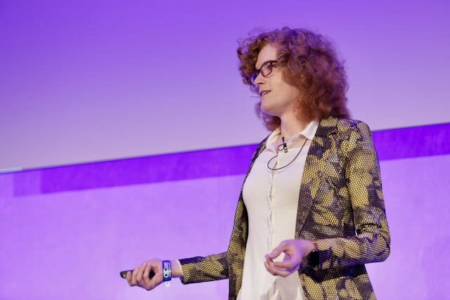

I spoke at QCon London 2022 about improving application performance through the
gradual addition of Rust code via FFI. This is similar in subject to my book,
Refactoring to Rust.

[Link to recording and slides on QCon Website (requires QCon login)](https://archive.qconlondon.com/london2022/presentation/blazing-fast-minimal-change-speed-up-your-code-by-refactoring-to-rust)
