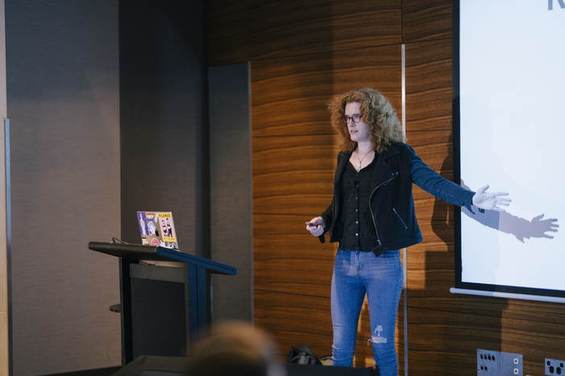

I spoke in Brisbane, Melbourne, and Sydney this year at the YOW! conferences. I
had an incredible time! The organizers put a ton of work into making the speaker
experience great and I hope that this translated into a great experience for the
attendees as well.

My talk was about OneSignal's experiences scaling Apache Kafka, the steps that
we took to improve concurrency across our Kafka consumers, and a debugging story
from a customer that violated some of our core assumptions.

!! youtube link will be added when YOW! posts it !!

[Download slides](./slides.pdf)

[Link to YOW Website](https://yowcon.com/brisbane-2022/sessions/2321/a-kafkaesque-series-of-events)
