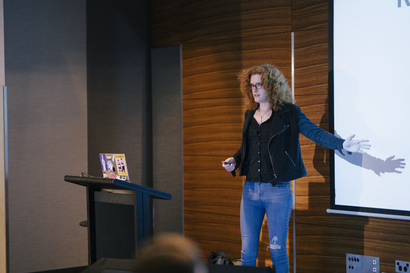

I spoke in Brisbane, Melbourne, and Sydney this year at the YOW! conferences. I
had an incredible time! The organizers put a ton of work into making the speaker
experience great and I hope that this translated into a great experience for the
attendees as well.

My talk was about OneSignal's experiences scaling Apache Kafka, the steps that
we took to improve concurrency across our Kafka consumers, and a debugging story
from a customer that violated some of our core assumptions.

I really enjoyed giving this talk at YOW! last year. My original plan for the
talk (and thus the abstract) included some content about Rust’s concurrency
system and the types of issues it could and could not catch at compile time.
This ended up falling by the wayside in favor of a deep dive on our system’s
abstract concurrency model and its inherent issues and benefits. I think it’s a
great sign for the maturity of the Rust language and ecosystem that people can
built highly scalable distributed concurrent systems in Rust, and Rist turns out
to be one of the less interesting parts of the whole stack.

I’d recommend this talk (not necessarily the concurrency model we chose, but the
talk itself) to anyone new to developing on top of Kafka or writing their own
app-level concurrency system with ordering requirements.

<iframe width="560" height="315" src="https://www.youtube.com/embed/oTjyvfQyarQ" title="YouTube video player" frameborder="0" allow="accelerometer; autoplay; clipboard-write; encrypted-media; gyroscope; picture-in-picture; web-share" allowfullscreen></iframe>

[Download slides](./slides.pdf)

[Link to YOW Website](https://yowcon.com/brisbane-2022/sessions/2321/a-kafkaesque-series-of-events)
